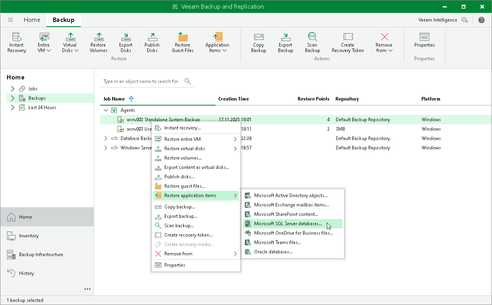

# Restoring Application Items

You can use Veeam Explorers to restore application items from backups created using Veeam Agent for Microsoft Windows. Veeam Backup & Replication lets you restore items and objects from the following applications:

* Microsoft Active Directory
* Microsoft Exchange
* Microsoft SharePoint
* Microsoft SQL Server
* Oracle

The procedure of application item restore from a Veeam Agent backup does not differ from the same procedure for a VM backup. To learn more, see the [Application Item Restore](https://helpcenter.veeam.com/docs/vbr/userguide/restore_veeam_explorers.html?ver=13) section in the Veeam Backup & Replication User Guide.

