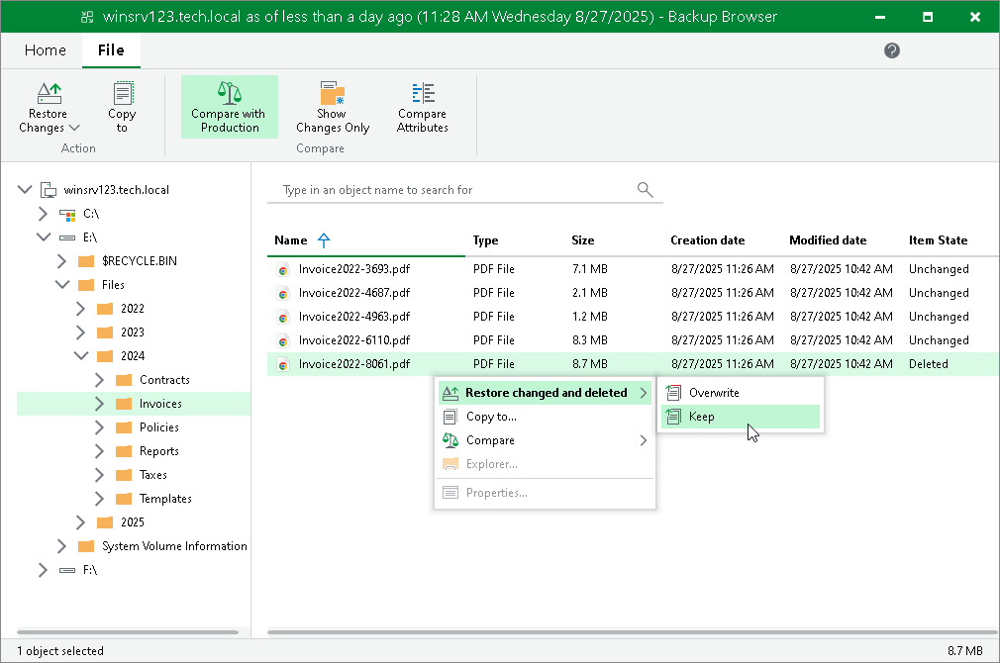

# Restoring Changed Files and Folders

To restore only changed files and folders to the original location, do the following:

1. Select the necessary files and folders in the file system tree or in the details pane on the right. Note that at least one file or folder must be in a comparison state. Files and folders in the non-comparison state, Veeam Backup & Replication will compare automatically.
2. Right-click one of the selected items and select one of the following:

* To overwrite the original files and folders with the ones restored from the backup, select Restore changed and deleted > Overwrite.

* To save the files and folders restored from the backup next to the original ones, select Restore changed and deleted > Keep.

Veeam Backup & Replication will add the RESTORED\_YYYYMMDD\_HHMMSS postfix to the original names and store the restored items in the same folder where the original items reside.

Alternatively, you can select the same commands on the ribbon.

If you want to restore entire files and folders to the original location, see [Restoring to Original Location](integration_file_restore_complete_original.md).

