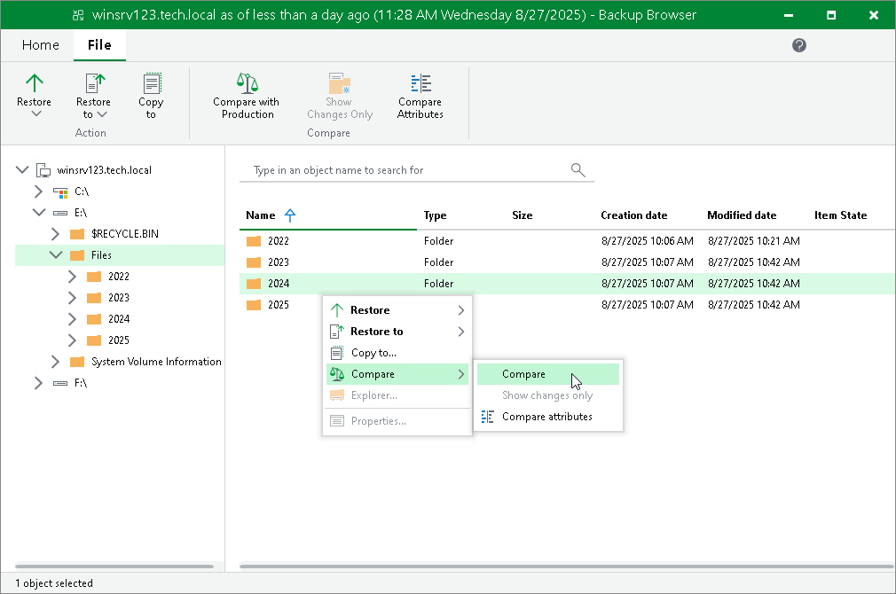
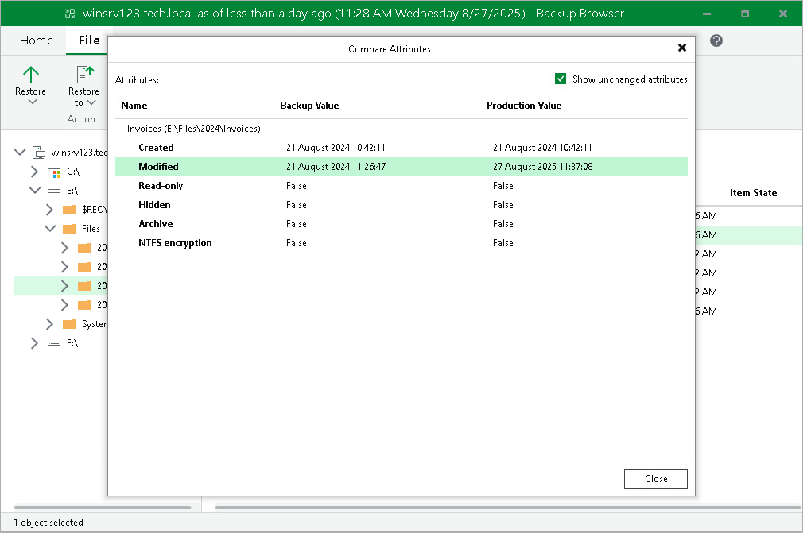

# Comparing Files and Folders

When Veeam Backup & Replication compares files, it compares their attributes. When Veeam Backup & Replication compares folders, it compares folder attributes, and also folder and file attributes inside the folder recursively. Once a file or folder with changed attributes is found, Veeam Backup & Replication stops comparing items and marks the folder as changed. If you further browse the folder in the compared state, Veeam Backup & Replication continues comparing non-compared files and folders. Veeam Backup & Replication compares the following attributes: Date Created, Date Modified, Size (only for files), Read-Only, Hidden, Archive, NTFS Encryption.

To compare files and folders from a backup with the files and folders stored in the original location:

1. Select the necessary files and folders in the file system tree or in the details pane on the right. You can also select disks. In this case, Veeam Backup & Replication will compare files and folders stored on the disks.
2. Right-click one of the selected items and select Compare > Compare or click Compare with Production on the ribbon.

1. If prompted, in the Credentials window, specify user credentials to access the original location.

After the comparison, files and folders will have the following comparison states in the Item State column: changed, unchanged, deleted, pending, or failed to compare. The states are updated when you turn off and then turn on the comparison mode, and when you start restoring changes of files and folders. Note that when comparing symbolic links, Veeam Backup & Replication compares attributes of the links, not the attributes of files and folders which the symbolic link points to.

For files and folders in the comparison states, Veeam Backup & Replication provides other restore operations than for files and folders in the non-comparison state. For example, you can restore only changed files and folders. For more information, see [Restoring Changed Files and Folders](integration_file_restore_complete_changed.md).

|  |
| --- |
| Tip |
| To show only changed files and folders (in the changed and deleted states), perform the compare operation, right-click any area in the Veeam Backup browser and select Compare > Show changes only or click Show Changes Only on the ribbon. Note that in this case the search field becomes unavailable. To show all files and folders, click the Show changes only option once again.  To switch off the comparison states, select an item in the comparison state and click Compare > Compare or click Compare with Production on the ribbon. Note that if you switch off comparison for child files and folders, comparison for parent folders will also be switched off. |

You can view which attributes were changed for files and folders:

1. Select the necessary files and folders in the file system tree or in the details pane on the right.
2. Right-click one of the selected items and select Compare > Compare attributes or click Compare Attributes on the ribbon.

In the Compare Attributes window, Veeam Backup & Replication shows changed attributes. If you want to show all attributes, click the Show unchanged attributes check box at the top right corner. Note that Veeam Backup & Replication shows attributes maximum for 500 files and folders and shows attributes for the selected files and folders, not for the nested files.

