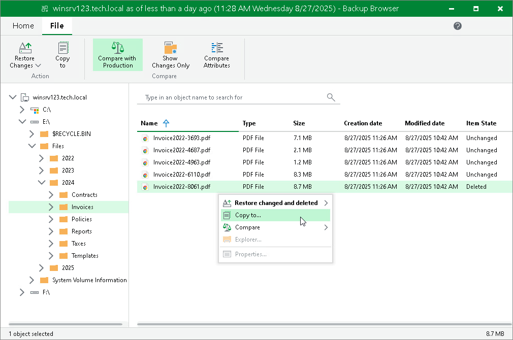

# Copying Files and Folders to Console or Shared Folder

To copy files and folders to the machine where the Veeam Backup & Replication console is installed or to a network shared folder:

1. Select the necessary files and folders in the file system tree or in the details pane on the right.
2. Right-click one of the selected items and click Copy to or click Copy to on the ribbon.
3. In the Choose Folder window, select the necessary destination:

+ To recover files and folders to a folder on the machine where the Veeam Backup & Replication console is installed, click Browse to find the necessary folder.
+ To recover files and folders to a network shared folder, enter a path to the destination folder in the Choose folder field.

1. In the Choose Folder window, choose whether to preserve original NTFS permissions or not:

+ To keep the original ownership and security permissions for the restored items, select the Preserve permissions and ownership check box.

Veeam Backup & Replication will copy selected files and folders along with associated Access Control Lists, preserving granular access settings.

|  |
| --- |
| IMPORTANT |
| To preserve permissions and ownership for the selected files and folders, you must run the Veeam Backup & Replication console under the Administrator account.  If you run the Veeam Backup & Replication console under any other account, you will see a warning message after you click Copy to at the step 2. In this case, close the Choose Folder window and click the Click here to run as administrator link in the warning window to elevate access rights. |

* If you do not want to preserve the original ownership and access settings for the restored items, leave the Preserve permissions and ownership check box not selected.

Veeam Backup & Replication will change security settings: the user who launched the Veeam Backup & Replication console will be set as the owner of the restored item, while access permissions will be inherited from the folder to which the restored item is copied.

1. If prompted, in the Credentials window, specify user credentials to access the destination location.

|  |
| --- |
| Note |
| Consider the following:   * The copy to operation does not use the comparison states and copies all selected files and folders. * When copying symbolic links, Veeam Backup & Replication copies the content which the links point to. |

