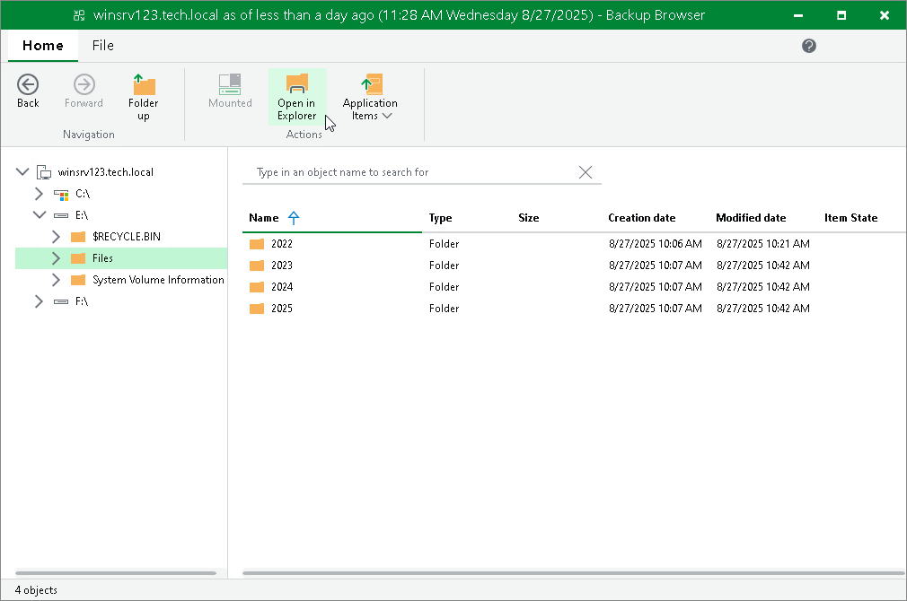

# Working with Microsoft Windows File Explorer

You can use Microsoft Windows File Explorer to work with restored files and folders:

1. On the ribbon of the Veeam Backup browser, switch to the Home tab and click Mount to Console to mount the Veeam Agent computer disks to the Veeam Backup & Replication console.
2. To open Microsoft Windows File Explorer, do the following:

* Click Open in Explorer on the Veeam Backup browser ribbon or right-click the necessary folder and select Explorer.
* Click File Explorer in the Start menu of the machine where Veeam Backup & Replication console is installed. Browse to the C:\VeeamFLR\<machinename>\<volume n> folder where the disks of the machine are mounted and find the necessary files.

|  |
| --- |
| Note |
| The Mount to Console button is not available if the mount point is already created on the Veeam Backup & Replication console. |

It is recommended that you use Microsoft Windows File Explorer only to view file content, not to restore files. For file restore, use Veeam Backup browser. This browser has the following advantages:

1. You can browse the Veeam Agent computer file system ignoring the file system ACL settings.
2. You can preserve permissions and ownership during file-level restore.

If you open the Veeam Agent computer file system in Microsoft Windows Explorer, these capabilities are not available. For more information, see [Microsoft Docs](https://docs.microsoft.com/en-us/windows/desktop/SecAuthZ/privilege-constants).

