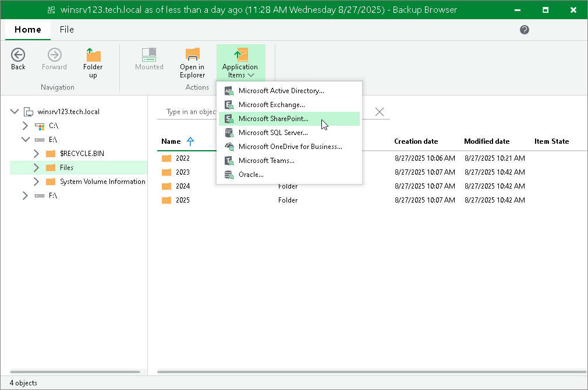

# Launching Application Item Restore

If you are restoring files from a Veeam Agent computer where the supported applications are installed, you can also launch application item restore directly from the Veeam Backup browser. Veeam Backup & Replication lets you restore items and objects from the following applications:

* Microsoft Active Directory
* Microsoft Exchange
* Microsoft SharePoint
* Microsoft SQL Server
* Oracle

To restore application items, Veeam Backup & Replication uses special tools called Veeam Explorers.

To launch application item restore, do the following:

1. On the ribbon, switch to the Home tab.
2. Click Application Items and select the required application.
3. In the opened Veeam Explorer, perform the necessary operations. For more information on Veeam Explorers, see the [Veeam Explorers User Guide](https://helpcenter.veeam.com/docs/vbr/userguide/explorers_introduction.html?ver=13).

