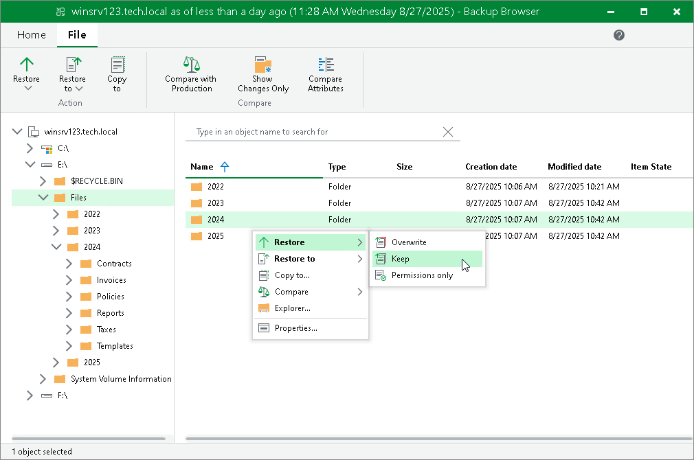

# Restoring Files and Folders to Original Location

To restore files and folders to the original location, do the following:

1. Select the necessary files and folders in the file system tree or in the details pane on the right.
2. Right-click one of the selected items and select one of the following:

* To overwrite the original files and folders with the ones restored from the backup, select Restore > Overwrite.
* To save the restored files and folders next to the original ones, select Restore > Keep.

Veeam Backup & Replication will add the RESTORED\_YYYYMMDD\_HHMMSS postfix to the original names and store the restored items in the same folder where the original items reside.

Alternatively, you can select the same commands on the ribbon.

