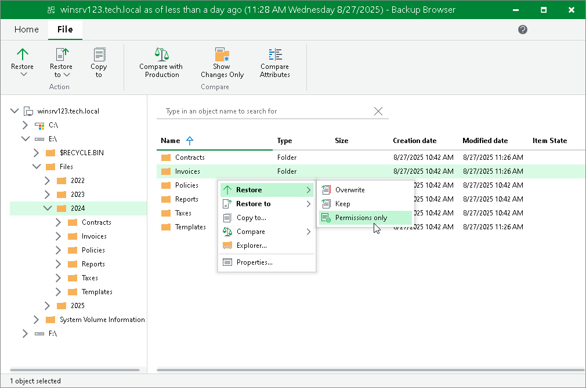

# Restoring Permissions

|  |
| --- |
| IMPORTANT |
| This functionality is available for files and folders only in the non-comparison state. |

To restore permissions for files and folders, do the following:

1. Select the necessary files and folders in the file system tree or in the details pane on the right.
2. Right-click one of the selected items and select Restore > Permissions only or select Restore > Permissions only on the ribbon.

