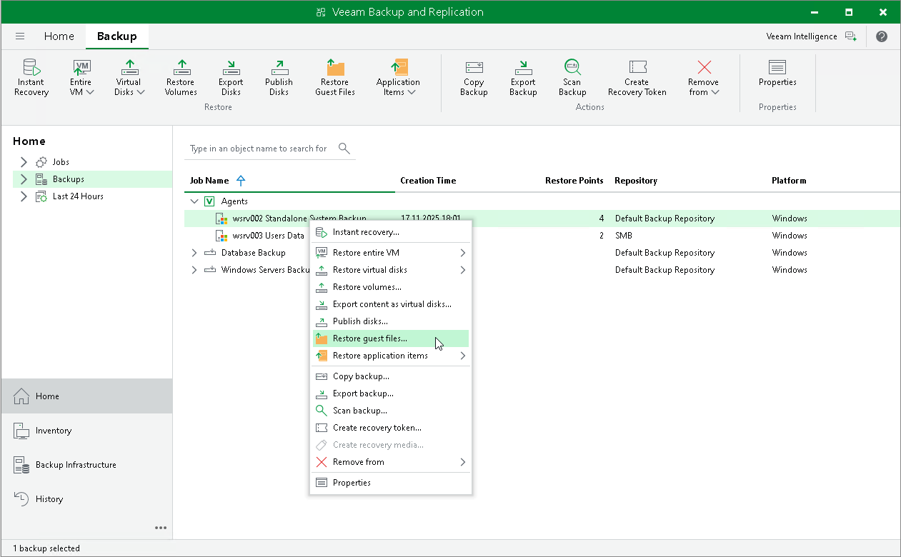

# Step 1. Launch File Level Restore Wizard

To launch the File Level Restore wizard, do either of the following:

* Open the Home tab and click Restore > Agent > Guest files restore. In this case, you will be able to select a Veeam Agent computer whose files and folders you want to restore at the [Machine](integration_file_restore_machine.md) step of the wizard.
* Open the Home view. In the inventory pane, click the Backups node. In the working area, expand the necessary Veeam Agent backup, select the necessary computer in the backup and click Restore Guest Files on the ribbon. Alternatively, right-click the computer and select Restore guest files. In this case, you will proceed immediately to the [Restore Point](integration_volume_restore_point.md) step of the wizard.

