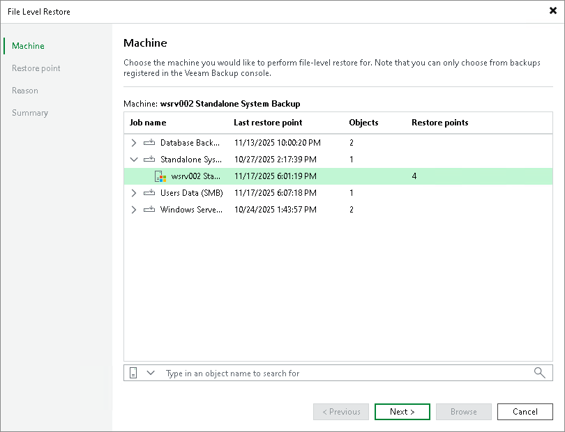

# Step 2. Select Machine

At the Machine step of the wizard, select a backup from which you want to recover data.

To quickly find the necessary backup, use the search field at the bottom of the window: enter a Veeam Agent computer name or a part of it in the search field and click Search or press [Enter].

