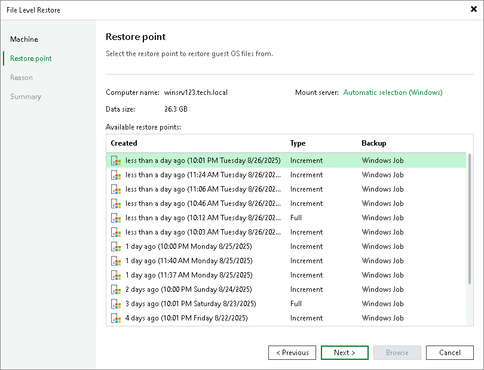

# Step 3. Select Restore Point

At the Restore Point step of the wizard, select a restore point from which you want to recover data.

By default, Veeam Backup & Replication uses the latest restore point. However, you can select any valid restore point to recover data from.

