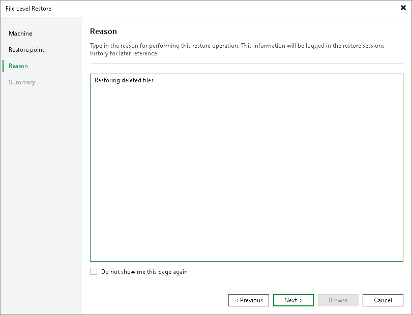

# Step 4. Specify Restore Reason

At the Reason step of the wizard, enter a reason for restoring data.

|  |
| --- |
| TIP |
| If you do not want to display the Restore Reason step of the wizard in future, select the Do not show me this page again check box. |

