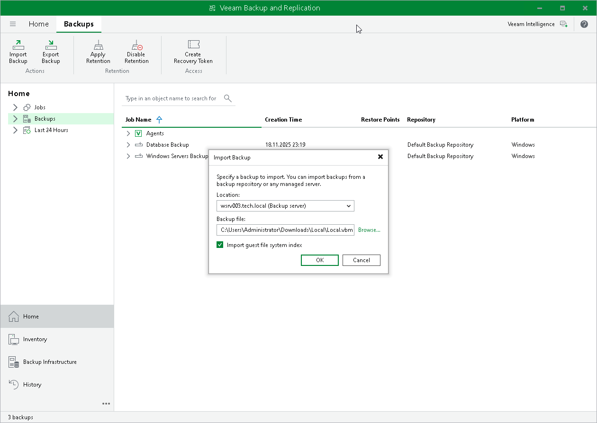

# Importing Veeam Agent Backups

You may need to import a Veeam Agent backup in the Veeam Backup & Replication console in the following situations:

* The Veeam Agent backup is stored on a drive managed by another computer (not the Veeam backup server).
* The Veeam Agent backup is stored in a backup repository managed by another Veeam backup server.

* The Veeam Agent backup has been removed in the Veeam Backup & Replication console.

After importing, the Veeam Agent backup becomes available in the Veeam Backup & Replication console. You can restore data from such backup in a regular manner.

Before importing a backup, check the following prerequisites:

* The computer or server from which you plan to import the backup must be added to Veeam Backup & Replication. Otherwise you will not be able to access backup files.
* To be able to restore data from previous backup restore points, make sure that you have all incremental restore points in the same folder where the full backup file resides.

To import a Veeam Agent backup:

1. In Veeam Backup & Replication, click Import Backup on the Home tab.
2. From the Computer list, select the computer or server on which the backup you want to import is stored.
3. Click Browse and select the necessary VBM or VBK file. If you select the VBM file, the import process will be notably faster. We recommend that you use the VBK files for import only if a corresponding VBM file is not available.
4. Click OK. The imported backup will become available in the Home view, under the Backups > Disk (imported) node in the inventory pane.

Importing Encrypted Backups

You can import Veeam Agent backups that were encrypted by Veeam Backup & Replication or Veeam Agent for Microsoft Windows.

To import an encrypted backup file:

1. On the Home tab, click Import Backup.
2. From the Computer list, select the host on which the backup you want to import is stored.
3. Click Browse and select the VBM or VBK file.
4. Click OK. The encrypted backup will appear under the Backups > Disk (encrypted) node in the inventory pane.
5. In the working area, select the imported backup and click Specify Password on the ribbon, or right-click the backup and select Specify password.
6. In the Password field, enter the password for the backup file. If you changed the password one or several times while the backup chain was created, you need to specify the latest password. For Veeam Agent backups, you can use the latest password to restore data form all restore points in the backup chain, including those restore points that were encrypted with an old password.

If you enter correct password, Veeam Backup & Replication will decrypt the backup file. The backup will be moved under the Backups > Disk (imported) node in the inventory pane.

