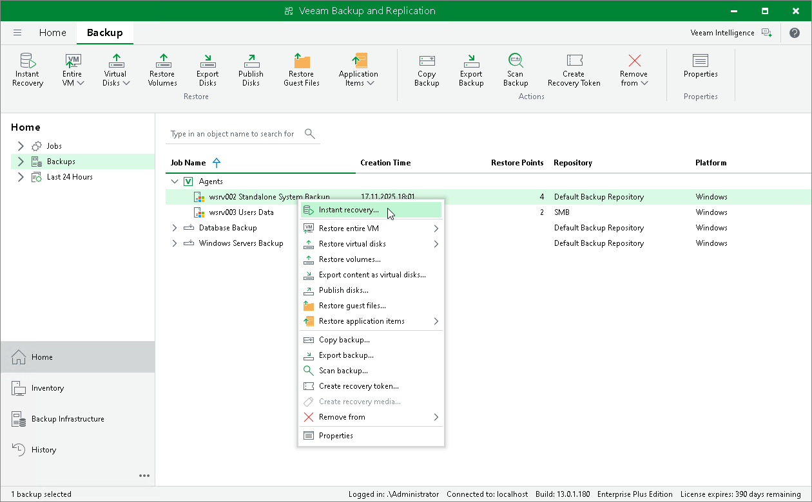

# Restoring Veeam Agent Backup to Hyper-V VM

In the Veeam Backup & Replication console, you can use Instant Recovery to restore a Veeam Agent computer as a Hyper-V VM in your virtualization environment.

A restored Hyper-V VM will have the same settings as the backed-up Veeam Agent computer. During the restore process, Veeam Backup & Replication retrieves settings of the Veeam Agent computer from the backup and applies them to the target VM.

Considerations and Limitations

If you restore a Veeam Agent computer to a Hyper-V VM, consider the following:

* You can use backups of Microsoft Windows computers stored in a Veeam backup repository only. You cannot use backups stored in a Veeam Cloud Connect repository for this operation.

* Make sure that the target host has enough resources for a new VM. Otherwise, your VM will reduce the target host performance.

* Veeam Agent computer disks are recovered as dynamically expanding virtual disks.
* By default, Veeam Backup & Replication automatically powers on a VM after restore. If you do not want to power on a VM after restore, you can change this setting during the Instant Recovery configuration process.

Restore to Hyper-V VM

The procedure of Instant Recovery for a Veeam Agent computer practically does not differ from the same procedure for a VM. The main difference from Instant Recovery is that you do not need to select the recovery mode, because Veeam Agent computers are always restored to a new location. To learn more, see the [Performing Instant Recovery of Workloads to Hyper-V](https://helpcenter.veeam.com/docs/vbr/userguide/performing_instant_recovery_hv_vm.html?ver=13) section in the Veeam Backup & Replication User Guide.

