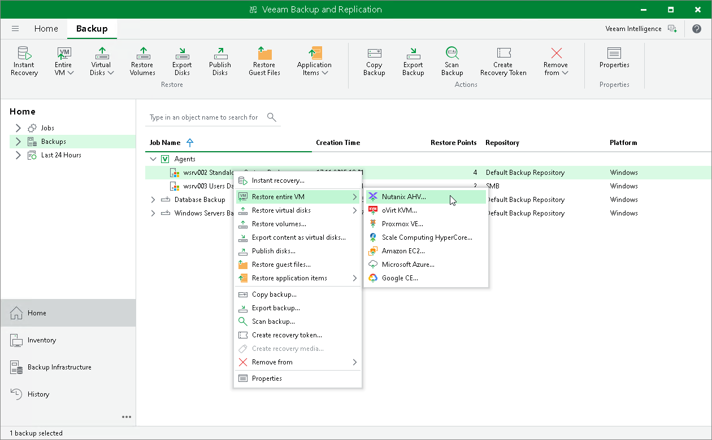

# Restoring Veeam Agent Backup to Nutanix VM

You can use the Veeam Backup & Replication console to restore a Veeam Agent computer as a Nutanix AHV VM in your virtualization environment.

Considerations and Limitations

If you restore a Veeam Agent computer to a Nutanix AHV VM, keep in mind that you can use backups of Microsoft Windows computers stored in a Veeam backup repository only. You cannot perform this operation with Veeam Agent backups stored in a Veeam Cloud Connect repository.

Restore to Nutanix AHV

The procedure of restore from a Veeam Agent backup to Nutanix AHV does not differ from the same procedure for a VM. To learn more about restore to Nutanix AHV, see the [Performing VM Restore](https://helpcenter.veeam.com/docs/vbahv/userguide/restore_to_ahv.html?ver=8) section in the Veeam Plug-in for Nutanix AHV User Guide.

