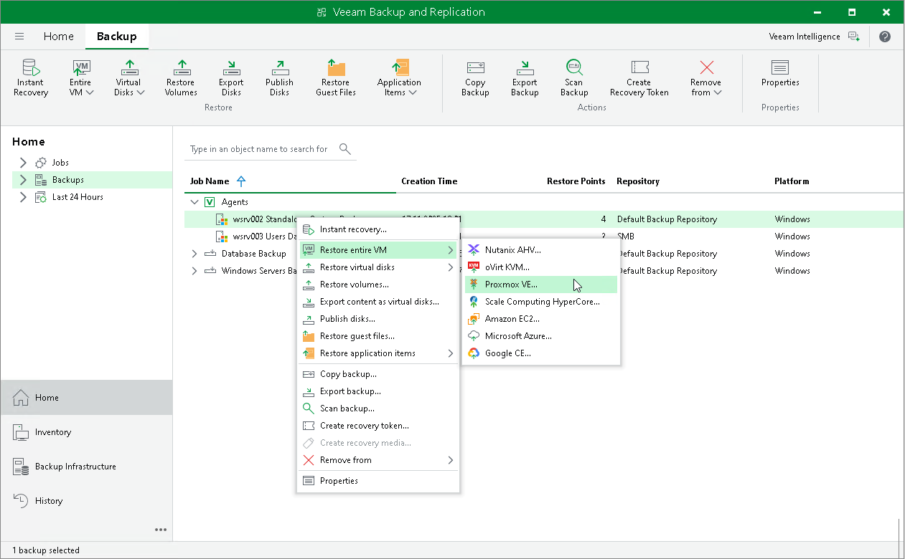

# Restoring Veeam Agent Backup to Proxmox VM

You can use the Veeam Backup & Replication console to restore a Veeam Agent computer as a Proxmox VE VM in your virtualization environment.

Considerations and Limitations

If you restore a Veeam Agent computer to a Proxmox VE VM, keep in mind that you can use backups of Microsoft Windows computers stored in a Veeam backup repository only. You cannot perform this operation with Veeam Agent backups stored in a Veeam Cloud Connect repository.

Restore to Proxmox VE

The procedure of restore to Proxmox VE for a Veeam Agent computer practically does not differ from the same procedure for a VM. To learn more about restore to Proxmox VE, see the [Performing VM Restore](https://helpcenter.veeam.com/docs/vbproxmoxve/userguide/restore_entire_vm.html?ver=1) section in the Veeam Backup for Proxmox VE User Guide.

