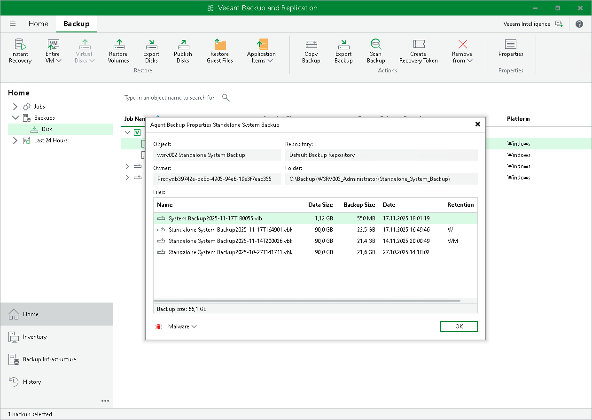

# Viewing Veeam Agent Backup Properties

You can view statistics about Veeam Agent backups.

To view Veeam Agent backup statistics:

1. In Veeam Backup & Replication, open the Home view.
2. In the inventory pane, click Disk under the Backups node.
3. In the working area, expand the Agents node, select the necessary backup and click Properties on the ribbon, or right-click the backup and select Properties.

