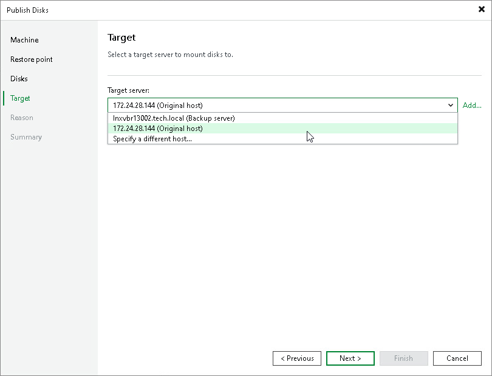

# Step 5. Select Target Server

At the Target step of the wizard, select a Microsoft Windows server that will have access to the disk content.

You can select one of the following types of servers:

* A server added to the backup infrastructure.

If you want to add a new backup server to the backup infrastructure at this step, click Add. In this case, you will be able to add a new Microsoft Windows server. To learn more, see the [Adding Microsoft Windows Servers](https://helpcenter.veeam.com/docs/vbr/userguide/add_windows_server.html?ver=13).

* A temporary server. In this case, select Specify a different host from the drop-down list. In the Target Server window, specify the following settings:

1. In the Host name field, specify a server name or IP address of the server.
2. Select the account from the Credentials list. If you have not set up credentials beforehand, click the Manage accounts link or click Add on the right to add a new account in the Credentials Manager. To learn more, see the [Credentials Manager](https://helpcenter.veeam.com/docs/vbr/userguide/credentials_manager.html?ver=13) section in the Veeam Backup & Replication User Guide.

* The original server. In this case, select Original server from the drop-down list.

If prompted, specify credentials for the target server.

