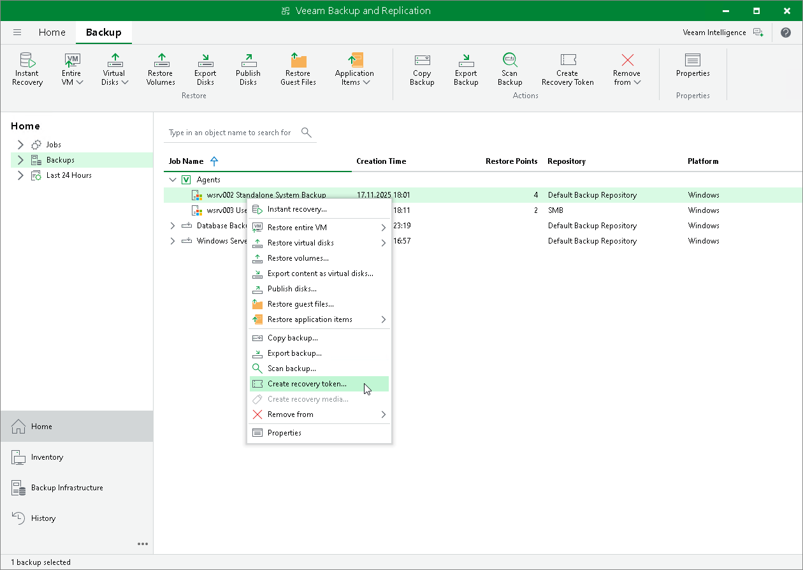

# Creating Recovery Token

You can create a recovery token for one or multiple Veeam Agent backups stored in a Veeam backup repository. A recovery token provides a limited-time access to the backup for which it was generated and can be used on the Veeam Agent computer side to connect to Veeam backup server during bare metal recovery. Using recovery tokens also eliminates the necessity to share Veeam backup server credentials.

To learn more about specifying a recovery token on the Veeam Agent computer side during bare metal recovery, see [Backup Server Settings](baremetal_vbr.md).

Considerations and Limitations

Before creating a recovery token, consider the following prerequisites and limitations:

* After generation, a recovery token remains valid for 24 hours.
* You can use a recovery token to restore files and folders only from the backups for which the token was generated. To view all backups in the repository and additional backup import options, use the password authentication instead.
* During recovery, Veeam Backup & Replication does not stop backup operations.
* You cannot create a recovery token for backups stored in a Veeam Cloud Connect repository.

Generating Recovery Token

To create a recovery token on the Veeam Backup & Replication side:

1. Open the Home view.
2. In the inventory pane, click Backups.
3. In the working area, right-click the backup and select Create recovery token.

You can create a recovery token for several backups. To do this, press and hold [Ctrl], select multiple backups, right-click one of the selected backups and select Create recovery token.

1. In the Create Recovery Token window, click Create.

You can modify the existing recovery token using the PowerShell console. To learn more, see the [Working with Tokens](https://helpcenter.veeam.com/docs/vbr/powershell/tokens.html?ver=13) section in the Veeam PowerShell Reference.

|  |
| --- |
| Tip |
| Alternatively, you can get access to the backup using user credentials. To learn more, see [Backup Server Settings](baremetal_vbr.md). |

