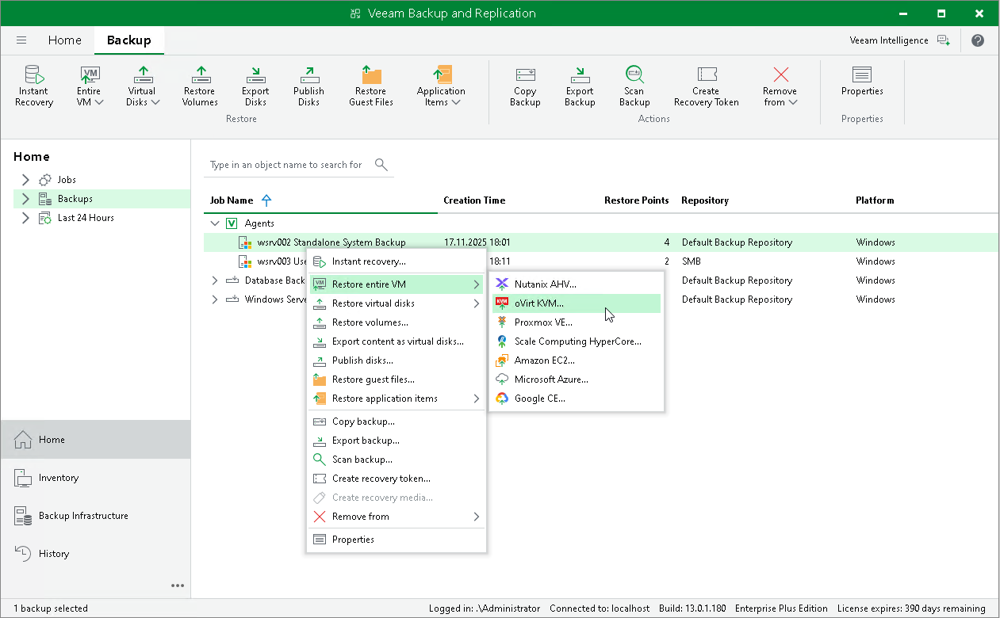

# Restoring Veeam Agent Backup to oVirt KVM VM

You can use the Veeam Backup & Replication console to restore a Veeam Agent computer as an oVirt KVM VM in your virtualization environment.

Considerations and Limitations

If you restore a Veeam Agent computer to an oVirt KVM VM, keep in mind that you can use backups of Microsoft Windows computers stored in a Veeam backup repository only. You cannot perform this operation with Veeam Agent backups stored in a Veeam Cloud Connect repository.

Restore to oVirt KVM VM

The procedure of restore to an oVirt KVM VM for a Veeam Agent computer practically does not differ from the same procedure for a VM. To learn more, see the [Performing VM Restore](https://helpcenter.veeam.com/docs/vbrhv/userguide/restore_to_rhv.html?ver=6) section in the Veeam Backup for Oracle Linux Virtualization Manager and Red Hat Virtualization User Guide.

