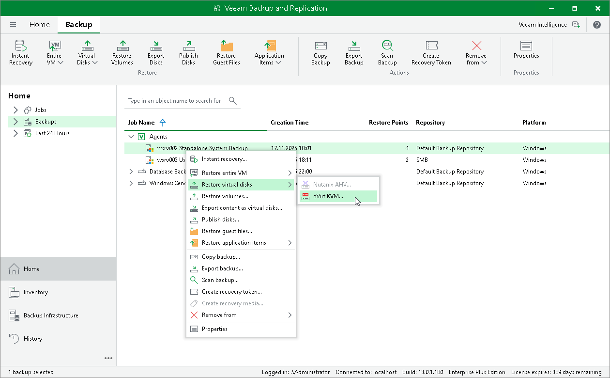

# Restoring Disk from Veeam Agent Backup to oVirt KVM

You can use the Veeam Backup & Replication console to restore disks from a Veeam Agent computer backup to an oVirt KVM VM in your virtualization environment.

Considerations and Limitations

If you restore disks to an oVirt KVM VM, keep in mind that you can use backups of Microsoft Windows computers stored in a Veeam backup repository only. You cannot perform this operation with Veeam Agent backups stored in a Veeam Cloud Connect repository.

Restore to oVirt KVM VM

The procedure of restoring disks to an oVirt KVM VM for a Veeam Agent computer practically does not differ from the same procedure for a VM. To learn more, see the [Performing Disk Restore](https://helpcenter.veeam.com/docs/vbrhv/userguide/restore_disks.html?ver=6) section in the Veeam Backup for Oracle Linux Virtualization Manager and Red Hat Virtualization User Guide.

