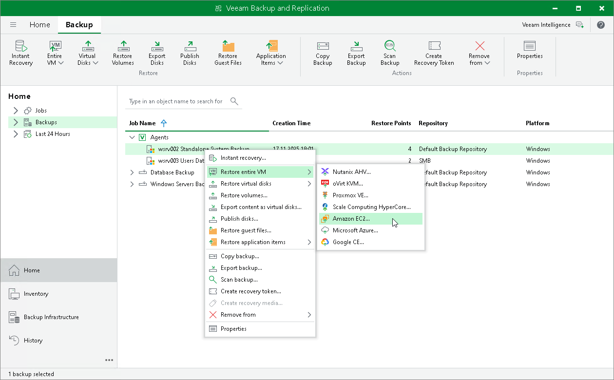

# Restoring to Amazon EC2

You can use the Veeam Backup & Replication console to restore computers from Veeam Agent backups to Amazon EC2.

Considerations and Limitations

If you restore a Veeam Agent computer to Amazon EC2, consider the following:

* You can use backups of Microsoft Windows computers stored in a Veeam backup repository only. You cannot perform this operation with Veeam Agent backups stored in a Veeam Cloud Connect repository.

* Veeam Agent backups must be created at the entire computer level or volume level.

Restore to Amazon EC2

The procedure of restore to Amazon EC2 from a Veeam Agent backup practically does not differ from the same procedure for a VM backup. To learn more about restore to Amazon EC2, see the [Restoring to Amazon EC2](https://helpcenter.veeam.com/docs/vbr/userguide/restore_amazon_process.html?ver=13) section in the Veeam Backup & Replication User Guide.

