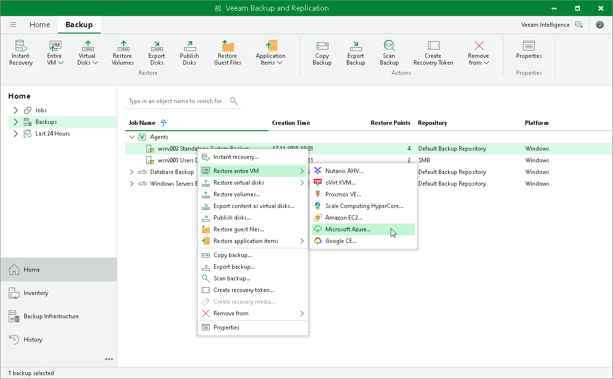

# Restoring to Microsoft Azure

You can use the Veeam Backup & Replication console to restore computers from Veeam Agent backups to Microsoft Azure.

Considerations and Limitations

If you restore a Veeam Agent computer to Microsoft Azure, consider the following:

* You can use backups of Microsoft Windows computers stored in a Veeam backup repository only. You cannot perform this operation with Veeam Agent backups stored in a Veeam Cloud Connect repository.

* Veeam Agent backups must be created at the entire computer level or volume level.

* If you recover an EFI-based system to Microsoft Azure, Veeam Agent will restore a BIOS-based Generation 1 VM.
* Veeam Backup & Replication offers experimental support for generation 2 VMs within restore to Microsoft Azure feature. To learn more, see the [Generation 2 VM Support](https://helpcenter.veeam.com/docs/vbr/userguide/restore_azure.html?ver=13#generation-2-vm-support) section in the Veeam Backup & Replication User Guide.

Restore to Microsoft Azure

The procedure of restore to Microsoft Azure from a Veeam Agent backup practically does not differ from the same procedure for a VM backup. To learn more about restore to Microsoft Azure, see the [Restoring to Microsoft Azure](https://helpcenter.veeam.com/docs/vbr/userguide/restore_azure_process.html?ver=13) section in the Veeam Backup & Replication User Guide.

