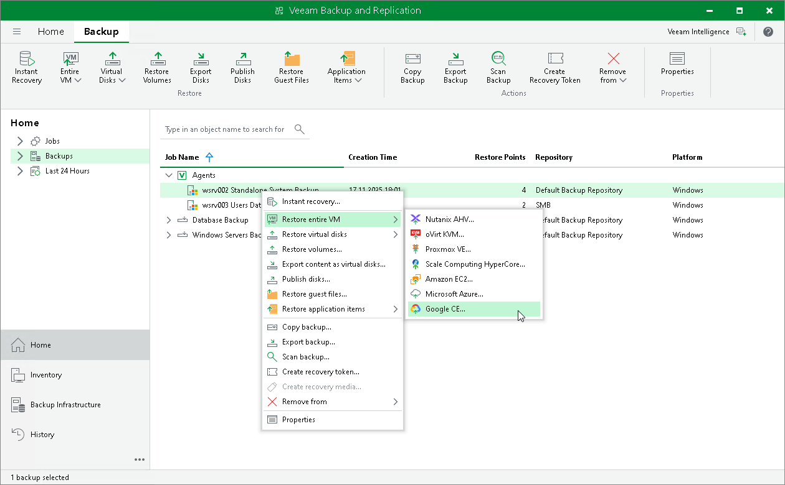

# Restoring to Google Compute Engine

You can use the Veeam Backup & Replication console to restore computers from Veeam Agent backups to Google Compute Engine.

Considerations and Limitations

If you restore a Veeam Agent computer to Google Compute Engine, consider the following:

* You can use backups of Microsoft Windows computers stored in a Veeam backup repository. You cannot perform this operation with Veeam Agent backups created on the Veeam Cloud Connect repository.
* Veeam Agent backups must be created at the entire computer level or volume level.

Restore to Google Compute Engine

The procedure of restore to Google Compute Engine from a Veeam Agent backup practically does not differ from the same procedure for a VM backup. To learn more about restore to Google Compute Engine, see the [Restoring to Google Compute Engine](https://helpcenter.veeam.com/docs/vbr/userguide/restore_google_process.html?ver=13) section in the Veeam Backup & Replication User Guide.

