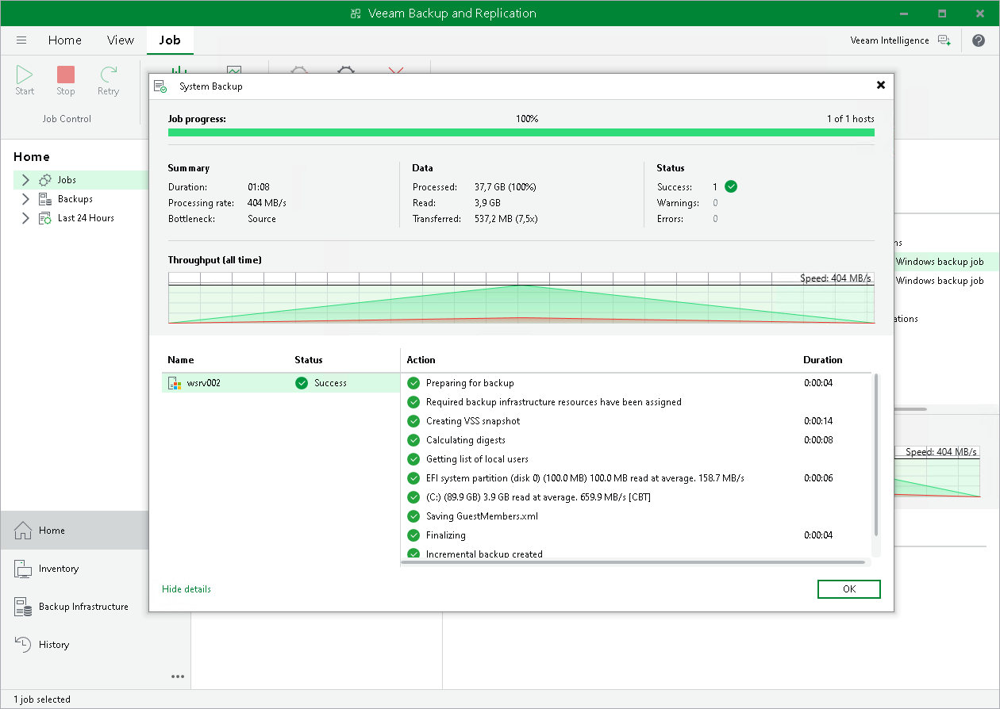

# Viewing Veeam Agent Backup Job Statistics

You can view statistics about Veeam Agent backup jobs in the Veeam Backup & Replication console. Veeam Backup & Replication displays statistics for Veeam Agent backup jobs in the similar way as for regular backup jobs. The difference is that the list of objects included in the job contains a Veeam Agent machine instead of one or several VMs.

To view Veeam Agent backup job statistics:

1. In Veeam Backup & Replication, open the Home view.
2. In the inventory pane, click the Jobs node.
3. In the working area, select the necessary Veeam Agent backup job and click Statistics on the ribbon, or right-click the job and select Statistics.

