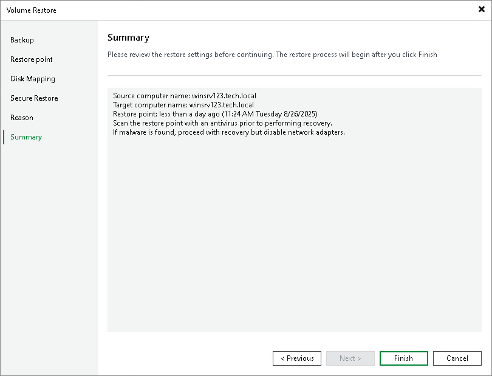

# Step 8. Complete Restore Process

At the Summary step of the wizard, complete the procedure of volume restore.

1. Review settings of the restore process.
2. Click Finish to start the recovery process. Veeam Backup & Replication will perform partition re-allocation operations if necessary, apply secure restore settings if specified, restore the necessary volume data from the backup and overwrite volume data on the target computer with the restored data.

