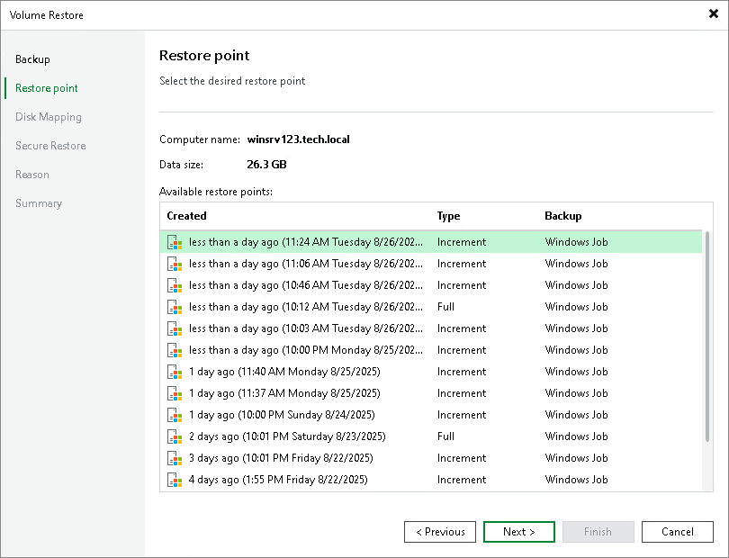

# Step 3. Select Restore Point

At the Restore Point step of the wizard, select a restore point from which you want to recover data.

By default, Veeam Backup & Replication uses the latest restore point. However, you can select any valid restore point to recover volumes to a specific point in time.

Veeam Backup & Replication displays restore points for volume-level backups only. For example, if you have run 3 job sessions to create a backup of all computer volumes and then changed the backup scope to file-level backup, Veeam Backup & Replication will display only 3 restore points in the list.

