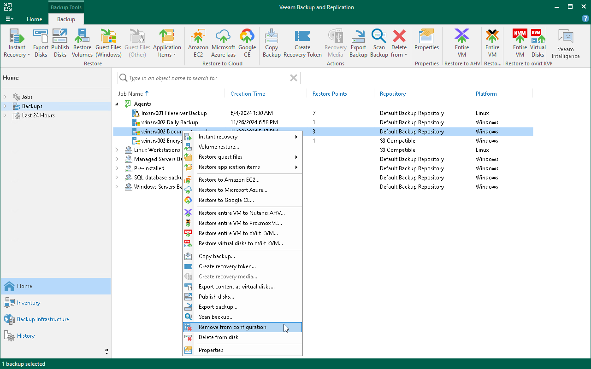

# Removing Veeam Agent Backups

If you want to remove records about Veeam Agent backups from the Veeam Backup & Replication console and configuration database, you can use the Remove from configuration operation. When you remove a Veeam Agent backup from configuration, the actual backup files remain in the backup repository. You can import the backup to the Veeam Backup & Replication at any time later and restore data from it.

|  |
| --- |
| IMPORTANT |
| Consider the following:   * Removing backups from configuration is designed for experienced users only. Consider using the [Remove from disk](integration_delete_from_disk.md) operation instead. * Do not remove a Veeam Agent backup from configuration if Veeam Agent is set up to use the backup cache and the backup cache contains one or several restore points that are not uploaded to the target location yet. If you remove such a backup and then import it in the Veeam Backup & Replication console, the backup will receive the new ID in the configuration database. As a result, Veeam Agent will become unable to upload restore points from the backup cache to the target location and to create new restore points in the backup cache. To continue creating backups in the Veeam backup repository, you will need to delete restore points from the backup cache and run the backup job to create a new restore point in the backup repository. |

To remove a Veeam Agent backup from configuration:

1. Open the Home view.
2. In the inventory pane, click Backups.
3. Press and hold the [Ctrl] key, select the backup, right-click the backup and select Remove from > Configuration.

