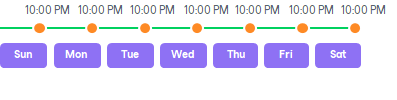
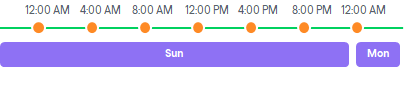
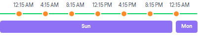
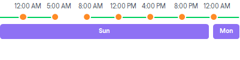
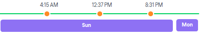

# Automatic Startup Schedule

Veeam Agent for Microsoft Windows lets you configure the following scheduling settings for jobs:

* [You can schedule the backup job to run at specific time every day or on selected days](#time)
* [You can schedule the backup job to run periodically at specific time intervals](#interval)
* [You can schedule the backup job to run continuously](#cont)

Job Started at Specific Time

You can schedule the backup job to start at specific time daily, on specific week days or monthly on selected days.

This type of schedule requires that you define the exact time when the job must be started. For example, you can configure the job to start daily at 10:00 PM or every first Sunday of the month at 12:00 AM.

Job Started at Specific Time Intervals

You can schedule the backup job to start periodically throughout a day at a specific time interval. The time interval between job sessions can be defined in minutes or hours. For example, you can configure a job to start every 30 minutes or every 2 hours.

For periodically run jobs, reference time is midnight (12:00 AM). Veeam Agent for Microsoft Windows always starts counting defined intervals from 12:00 AM, and the first job session will start at 12:00 AM. For example, if you configure a job to run with a 4-hour interval, the job will start at 12:00 AM, 4:00 AM, 8:00 AM, 12:00 PM, 4:00 PM and so on.

If necessary, you can specify an offset for periodically run jobs. The offset is an exact time within an hour when the job must start. For example, you can configure the job to start with a 4-hour interval and specify offset equal to 15 minutes. In this case, the job will start at 12.15 AM, 4:15 AM, 8:15 AM, 12:15 PM, 4:15 PM and so on.

If a session of the periodically run job does not fit into the specified time interval and overlaps the next planned job session, Veeam Agent for Microsoft Windows starts the next backup job session at the nearest scheduled interval. For example, you set up the job to run with a 4-hour interval. The first job session starts at 12:00 AM, takes 5 hours and completes at 5:00 AM. In this case, Veeam Agent for Microsoft Windows will start a new job session at 8:00 AM.

Job Run Continuously

You can schedule the job to run continuously — that is, in a non-stop manner. A new session of the continuously running job starts as soon as the previous job session completes. Continuously run job can help you implement near-continuous data protection (near-CDP) for the most critical applications.

