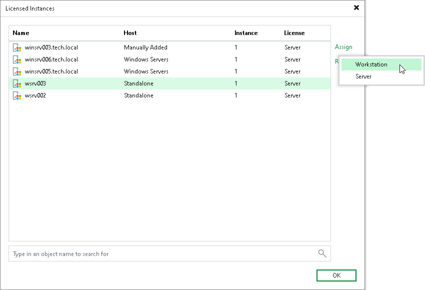

# Assigning License to Veeam Agent

After Veeam Agent connects to Veeam Backup & Replication, Veeam Agent automatically starts consuming the license. The product edition for Veeam Agent is selected depending on the type of the OS running on the protected computer.

You can also assign a license to Veeam Agent manually if needed. When you assign a license, you can select the product edition, too.

To assign a license:

1. In Veeam Backup & Replication, from the main menu, select License.
2. In the License Information window, select the Instances tab and click Manage.
3. In the Licensed Instances window, select the Veeam Agent to which you want to assign the license, click Assign and select the desired product edition: Workstation or Server.

