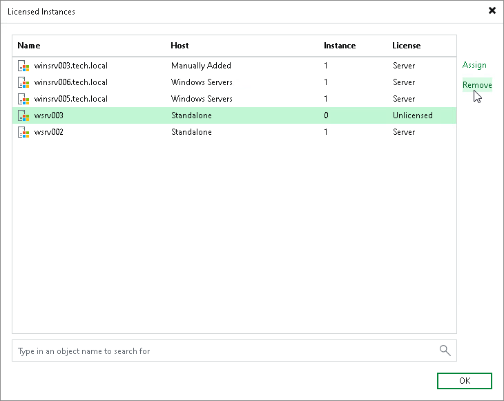

# Viewing Licensed Veeam Agents and Revoking License

When Veeam Agent connects to the backup server, Veeam Backup & Replication applies a license to the Veeam Agent. You can view to which Veeam Agents the license is currently applied.

To view a list of licensed Veeam Agents:

1. In Veeam Backup & Replication, from the main menu, select License.
2. In the License Information window, select the Instances tab and click Manage.

In the list of licensed instances, Veeam Backup & Replication displays Veeam Agents that have established a connection with the backup server when you created the backup job.

Revoking License from Veeam Agents

You can revoke the license from some Veeam Agents and re-apply it to other protected workloads. License revoking can be helpful, for example, if you do not want to use some Veeam Agents with Veeam Backup & Replication anymore.

To revoke a license from the Veeam Agent:

1. In Veeam Backup & Replication, from the main menu, select License.
2. In the License Information window, select the Instances tab and click Manage.
3. In the Licensed Instances window, select a Veeam Agent and click Revoke. Veeam Backup & Replication will revoke the license from the Veeam Agent, and the license will be freed for other workloads that you want to protect with Veeam products.

The Veeam Agent from which you have revoked the license will become unable to connect to the Veeam backup server but will remain in the Licensed Instances list. To allow this Veeam Agent to create backups in the Veeam backup repository, select the Veeam Agent and click Remove. During the next backup job session, the Veeam Agent will connect to the Veeam backup server and start consuming the license.

