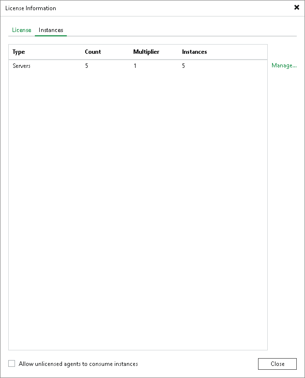

# Managing Instance Consumption by Veeam Agents

By default, Veeam Backup & Replication allows Veeam Agents to connect to the Veeam backup server and consume instances in the license. If you do not want Veeam Agents to consume instances, you can restrict instance consumption.

If you restrict instance consumption, Veeam Backup & Replication will switch all Veeam Agents connected to this Veeam backup server to the free edition that offers limited capabilities. For information about Veeam Agent editions, see [Product Editions](license_editions.md) .

To restrict instance consumption by Veeam Agents:

1. In Veeam Backup & Replication, from the main menu, select License.
2. In the License Information window, click the Instances tab.
3. On the Instances tab, clear the Allow unlicensed agents to consume instances check box.
4. Click Close.

