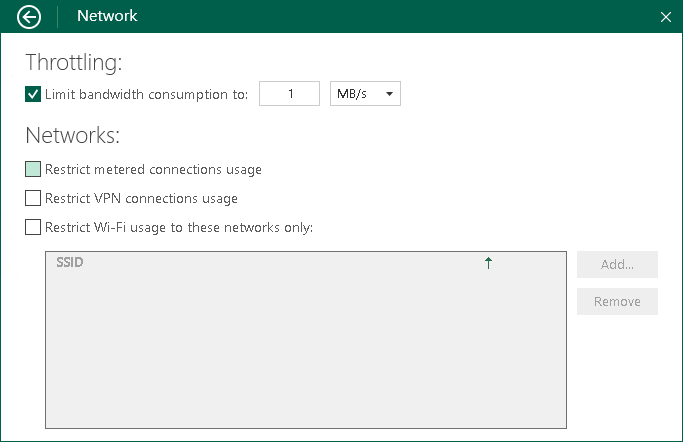

# Disabling Backup over Metered Connections

Veeam Agent can disable backup over metered Internet connections to help you avoid extra costs. If you use a metered Internet connection, your service provider charges you by the amount of data sent and received by your computer. Veeam Agent automatically detects metered connections and will not perform backup when your computer is on such connection.

|  |
| --- |
|  NOTE |
| You must specify which connections are metered in Microsoft Windows. To learn more, see [this Microsoft KB article](https://support.microsoft.com/en-us/help/17452/windows-metered-internet-connections-faq). |

By default, backup over metered connections is disabled. To enable backup over metered connections:

1. Double-click the Veeam Agent for Microsoft Windows icon in the system tray, or right-click the Veeam Agent for Microsoft Windows icon in the system tray and select Control Panel.
2. From the main menu, select Settings.
3. Click the Manage networks link.
4. In the Networks section, clear the Restrict metered connections usage check box.

|  |
| --- |
|  NOTE |
| For the cases when backup over metered connections is disabled, consider the following:   * If you start the backup job manually when only a metered connection is available, Veeam Agent for Microsoft Windows will display a warning and ask you to confirm that you want to use this connection for backup. * If you start the backup job with the command line interface, Veeam Agent will ignore the setting and will use metered connections for backup. * If you enable the backup cache for the backup job, and this backup job starts upon schedule when only a metered connection is available, Veeam Agent for Microsoft Windows will save the backup file to the backup cache. If the backup cache is not enabled, the backup job will fail. |

