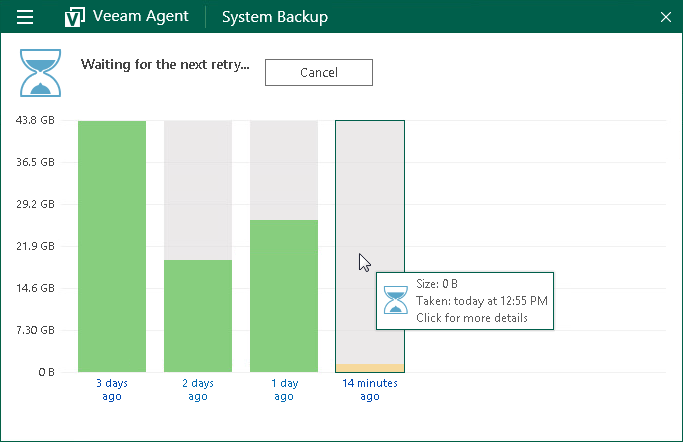
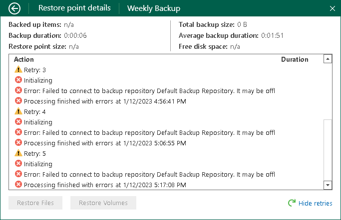

# Viewing Information About Job Retries

If the backup job started by schedule has failed for some reason, Veeam Agent for Microsoft Windows retries the job if one of the following conditions is met:

* You use the Workstation edition of Veeam Agent for Microsoft Windows.
* You use the Server edition of Veeam Agent for Microsoft Windows and the automatic retry is enabled in the [backup job schedule settings](backup_job_schedule_server.md).

|  |
| --- |
|  NOTE |
| For portable devices, Veeam Agent for Microsoft Windows does not automatically retry the backup job if a device is working on battery and the battery level is below 20%. |

To view detailed information about the backup job retries:

1. Double-click the Veeam Agent for Microsoft Windows icon in the system tray, or right-click the Veeam Agent for Microsoft Windows icon in the system tray and select Control Panel.
2. At the top of the control panel window, check the name of the backup job.

If multiple backup jobs are configured in Veeam Agent for Microsoft Windows, and you want to view statistics of another job, in the main menu, hover over the name of the necessary job and select Open.

1. Click the necessary bar in the chart.
2. At the bottom right corner of the window, click the Show retries link.
3. After you view details, you can hide them. To do this, at the bottom right corner of the window, click the Hide retries link.

