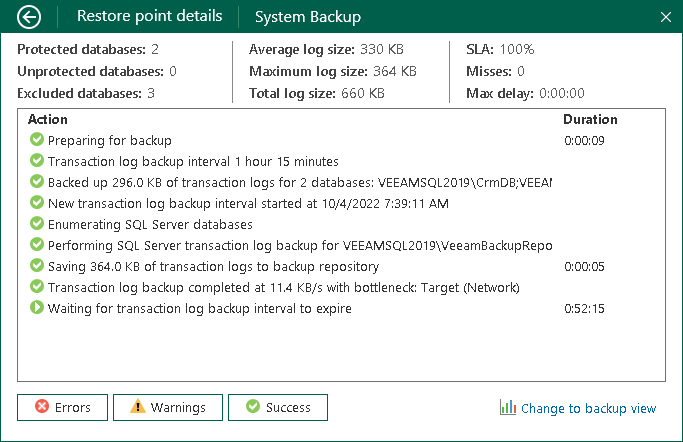

# Transaction Log Backup Statistics

If transaction log backup is enabled for the job, you can use the Veeam Agent control panel to view transaction log backup statistics.

Veeam Agent for Microsoft Windows provides the following information about transaction log processing:

* Protected databases: number of databases that were backed up at least once during the last session.
* Unprotected databases: number of databases that failed to be backed up during the last session.
* Excluded databases: databases excluded from processing. Databases may be excluded for the following reasons: database status is Offline, database recovery model is set to Simple, database is read-only, database was deleted after the latest full backup, database is added to the list of exclusions.

* Average log size: average amount of data read from the OS through all intervals.
* Max log size: maximal amount of data read from the OS over all 15-min intervals.
* Total log size: total amount of data written to the target location.

* SLA: how many log backup intervals completed in time with successful log backup (calculated as percentage of total number of intervals).
* Misses: how many intervals were missed (number of intervals).
* Max delay: difference between the configured log backup interval and time actually required for log backup. If exceeded, a warning is issued.

* Details on operations performed during the transaction log backup job session.

To view statistics on the transaction log backup processing:

1. Double-click the Veeam Agent for Microsoft Windows icon in the system tray or right-click the icon and select Control Panel.
2. At the top of the control panel window, check the name of the backup job.

If multiple backup jobs are configured in Veeam Agent for Microsoft Windows, and you want to view statistics of another job, in the main menu, hover over the name of the necessary job and select Open.

1. Click the necessary bar in the chart.
2. In the Restore point details window, click the Change to database view link at the bottom right corner of the window. Veeam Agent for Microsoft Windows will display detailed statistics on the transaction log backup. To get back to the general statistics for the selected restore point, click the Change to backup view link.

To get back to a chart view, click the arrow icon at the top left corner of the window.

