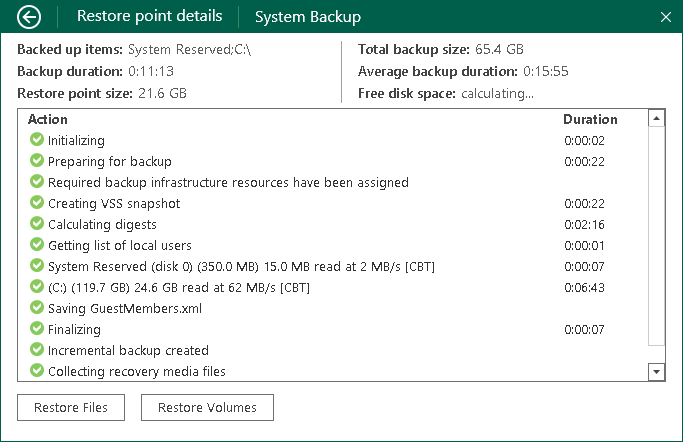

# General Statistics

Veeam Agent for Microsoft Windows provides the following information about separate restore points in the backup chain:

* Backed-up items: items that you have chosen to back up.
* Backup duration: duration of the backup job session.
* Restore point size: size of the resulting backup file.
* Total backup size: total size of all backup files created by the backup job in the target location.

Keep in mind that if you store your backups in a scale-out backup repository with a performance tier located in object storage, the total backup size may differ from the size of all restore points in the backup chain. In this case, Veeam Agent displays only the size of the restore points stored in the performance tier.

For more information about the scale-out backup repository, see the [Scale-Out Backup Repositories](https://helpcenter.veeam.com/docs/vbr/userguide/backup_repository_sobr.html?ver=13) section in the Veeam Backup & Replication User Guide.

* Average backup time: average time of all successful backup job sessions displayed in the chart.
* Free disk space: amount of free disk space remaining in the target location.
* Details on operations performed during the backup job session.

To view the restore point statistics:

1. Double-click the Veeam Agent icon in the system tray or right-click the icon and select Control Panel.
2. At the top of the control panel window, check the name of the backup job.

If multiple backup jobs are configured in Veeam Agent, and you want to view statistics of another job, in the main menu, hover over the name of the necessary job and select Open.

1. Click the necessary bar in the chart.
2. Veeam Agent will display detailed statistics on the selected backup job session. To get back to a chart view, click the arrow icon at the top left corner of the window.

If transaction log backup is enabled for the job, you can also view transaction log backup statistics. To learn more, see [Transaction Log Backup Statistics](monitoring_restore_points_db.md).

