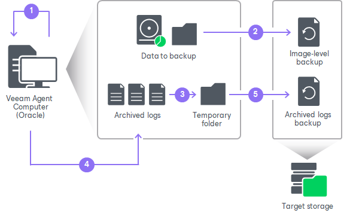

# How Oracle Archived Log Backup Works

The archived log backup for Oracle is performed in the following way:

1. Veeam Agent for Microsoft Windows launches the parent backup job by schedule.
2. The parent backup job creates a volume-level or file-level backup and stores it to the backup location.
3. A new session of the archived log backup starts. Veeam Agent for Microsoft Windows scans the Oracle system and collects information about databases whose logs must be processed, including:

* List of all databases
* Database state — a database is on or off, in which logging mode it runs
* Paths to all database files (configuration logs and so on) and other data required for backup

Veeam Agent for Microsoft Windows copies archived log files from the log archive destination (set by the Oracle administrator) to a temporary folder on the Veeam Agent computer.

1. Veeam Agent for Microsoft Windows maps information about the Oracle system collected at the step 3 with information kept in the Veeam Agent for Microsoft Windows database. This periodic mapping helps reveal databases for which Veeam Agent for Microsoft Windows must ship archived logs to the backup location during this time interval.
2. Archived log backup files are transferred from the temporary folder on the Veeam Agent computer to the backup location.
3. If you configure the backup job to delete archived log backup files, Veeam Agent deletes archived log backup files from the backup location according to selected [Oracle archived log settings](backup_job_vss_oracle.md).

Archived logs that for some reason were not processed during the log backup interval remain in the temporary folder and are processed during the next log backup interval. To detect these remaining logs, Veeam Agent for Microsoft Windows enumerates log files in the temporary folder.

|  |
| --- |
|  NOTE |
| If a new session of the archived log backup starts and the parent backup job has not created a new restore point yet, the transaction log backup job will remain in the idle state, waiting for a new restore point to be created. |

