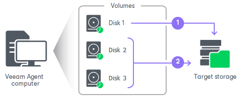

# Parallel Disk Processing

Veeam Agent for Microsoft Windows supports parallel disk processing. If you included several disks of the Veeam Agent computer in the backup scope, Veeam Agent will process disks simultaneously.

How Parallel Disk Processing Works

During backup, Veeam Agent for Microsoft Windows requests the creation of a Microsoft VSS snapshot of the volume whose data you want to back up as described in section [How Backup Works](backup_hiw.md). After the VSS snapshot is created, Veeam Agent transfers data blocks of disks to the target storage simultaneously.

The number of disks that are simultaneously processed by Veeam Agent is limited by repository settings on the Veeam Backup & Replication side. During the backup job session, Veeam Backup & Replication compares the number of currently processed disks to the limit specified in the properties of the backup repository. If the number of currently processed disks is greater than the limit, Veeam Agent will not transfer data of a new disk. Only after data transfer for at least one of the disks completes, Veeam Agent starts data transfer for the next disk. To learn more, see the [Limitation of Concurrent Tasks](https://helpcenter.veeam.com/docs/vbr/userguide/limiting_tasks.html?ver=13) section in the Veeam Backup & Replication User Guide.

You can also limit the number of disks that are processed simultaneously with a registry value. Keep in mind that if the number of simultaneously processed disks is limited by both repository settings and registry value, Veeam Agent uses the lower limit. To learn more about the registry value, see [this Veeam KB article](https://www.veeam.com/kb3157).

If processing of at least one disk fails, the entire backup job session completes with an error.

Limitations for Parallel Disk Processing

* Parallel disk processing is available only in the Server edition of Veeam Agent for Microsoft Windows.
* Veeam Agent offers parallel disk processing for backups that are created in the following types of target locations:

+ Veeam backup repository
+ Veeam Cloud Connect repository

* Parallel disk processing is not supported for dynamic disks.
* Parallel disk processing is not performed for file-level backups.

