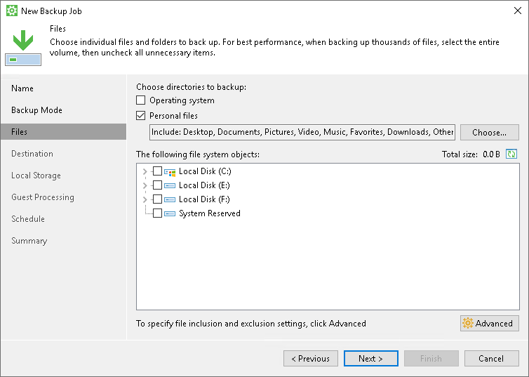
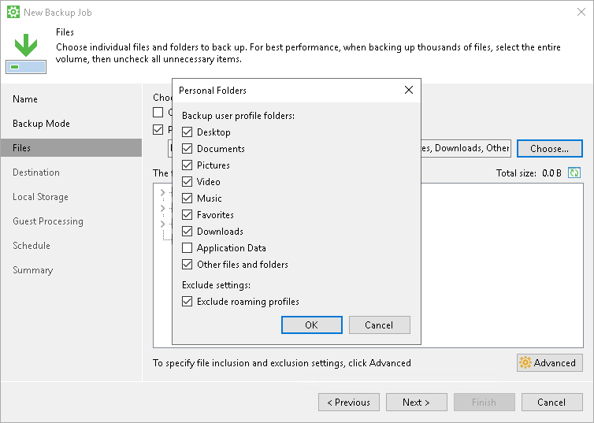
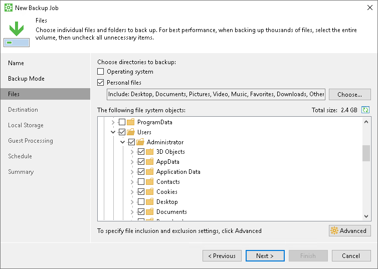

# Personal Data Backup

You can include personal data in the backup. In the file-level backup, to simplify this process, Veeam Agent for Microsoft Windows offers you to add the Personal files component to the backup scope. When you select to back up the personal data, Veeam Agent automatically includes in the backup data related to Veeam Agent computer user profiles.

Personal Data Backup in File-Level Backup

To include personal data in the file-level backup, select the Personal files option. When you select to back up the personal data by default, Veeam Agent includes in the backup all data stored in the Users folder on the system volume excluding application data and data related to roaming user profiles. If you store personal folders of user profiles in custom locations, Veeam Agent backs up them too. If you do not want to back up default personal data, you can change the backup scope by selecting what folders Veeam Agent includes in the Personal files component.

|  |
| --- |
| NOTE |
| Veeam Agent does not classify Azure Active Directory user profile data as Personal files. As a result, such data may be excluded from the backup under this option. |

|  |
| --- |
| TIP |
| * By default, in the Personal Folders window, all options are selected in the Backup user profile folders list excluding the Application Data option and the Exclude roaming profiles option is selected.      * If Veeam Agent fails to back up personal data, Veeam Agent displays a warning message in the job session and a warning notification for each folder that Veeam Agent failed to back up. If you do not want to get these warnings, you can disable them with a registry value. To learn more, [contact Veeam Customer Support](support_report.md). |

You can use the Other files and folders option to back up all folders and files that are located in the Users folder on the system volume, but are not available in the Personal Folders window. Keep in mind that depending on the Other files and folders option, Veeam Agent behaves in one of the following ways:

* If the option is cleared, Veeam Agent backs up only selected personal folders in the Users folder on the system volume and personal folders stored in custom locations. Keep in mind, that in such case Veeam Agent backs up only those user profiles that are related to authenticated users. As a result, for example, default and system user profiles will be excluded. Besides that, temporary and corrupted user profiles will be excluded too.
* If the option is selected, Veeam Agent backs up all files and folders in the Users folder on the system volume and personal folders stored in custom locations, but excludes personal data according to the options that you cleared.

Alternatively, you can explicitly select to back up the Users folder. In this case, you still will be able to exclude specific subfolders of the Users folder from the backup. But you will need to exclude subfolders for each user manually. You will also need to find user folders stored in custom locations and include subfolders there if necessary. Thus, we recommend that you use the Personal files component to create personal data backup.

Personal Data Backup in Volume-Level Backup

Typically, data and settings of the Veeam Agent computer users are located in the Users folder on the system volume, for example, C:\Users. Thus, to include the operating system data in the volume-level backup, you must explicitly select to back up the system volume.

Related Tasks

[Selecting Backup Mode](backup_job_mode.md)

