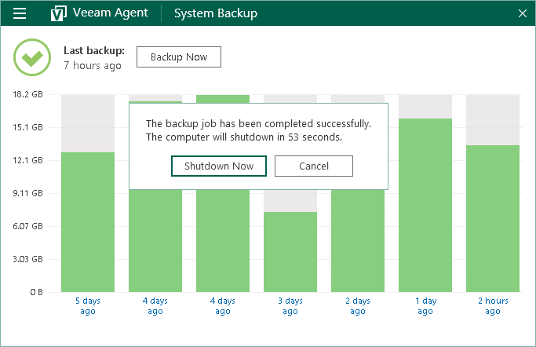

# Controlling Backup Post-Job Action

In the Free and Workstation product editions, you can set up Veeam Agent to perform a finalizing action after the backup job completes successfully:

* Sleep — bring your computer to the standby mode.
* Hibernate — bring your computer to the hibernate mode.
* Shutdown — shut down your computer.

To learn more, see [Specify Backup Schedule](backup_job_schedule_free_desktop.md).

When the backup job completes, Veeam Agent opens control panel and prompts a dialog with a countdown to the specified action. Timeout between the backup job completion and the backup post-job action is 60 seconds.

* To proceed to the backup post-job action immediately, click Sleep/Hibernate/Shutdown Now.
* To cancel the action (for example, if you want to continue working or to save your data before turning off the computer), click Cancel.

If you do not select any option, Veeam Agent will perform the specified action when timeout expires.

