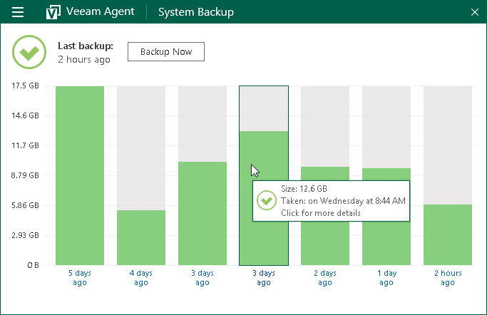
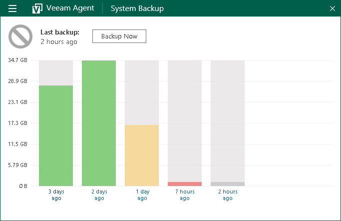
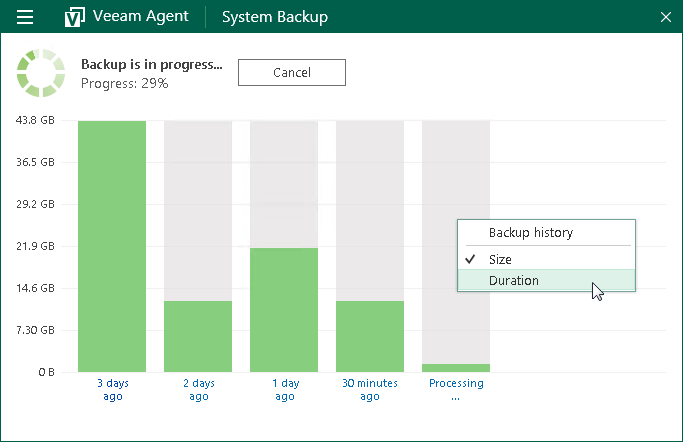
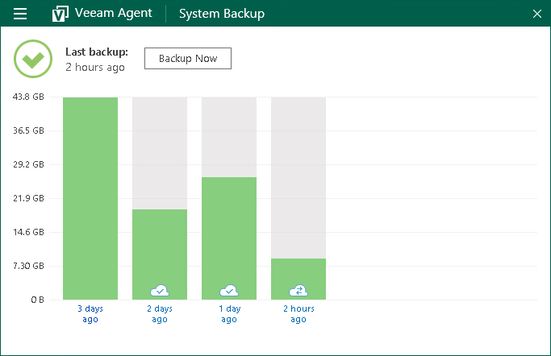

# Viewing Statistics in Control Panel

You can use the Veeam Agent control panel to view statistics about performed backups. To open the Control Panel, do either of the following:

* Double-click the Veeam Agent icon in the system tray.
* Right-click the Veeam Agent icon in the system tray and select Control Panel.

For every configured backup job, Veeam Agent displays statistics in a separate view in the control panel. To identify the job whose statistics is currently displayed in the Control Panel, check the name of the job at the top of the Control Panel window.

If you configured multiple backup jobs in Veeam Agent, after you open the Control Panel, the Control Panel displays statistics for the first job that you configured. To switch to another job, in the main menu, hover over the name of the necessary job and select Open.

The Control Panel displays information about backup job sessions that run previously and a backup job session that is currently running. Every bar represents a separate backup job session. To view general information about a specific job session, hover the mouse over the necessary bar in the chart. Veeam Agent will provide the following details: backup status, backup time and size of the resulting backup file.

The bar color identifies the status of the backup job session. The backup job session can complete with one of the following statuses:

* Success (green color) — the backup job is currently running or has completed successfully.

* Warning (yellow color) — the backup job has completed with a warning. Veeam Agent for Microsoft Windows has managed to create the resulting backup file but you need to pay your attention to some alerts, for example: the target location is running low on disk space.
* Error (red color) — the backup job has completed with an error. The resulting backup file has not been created.
* Canceled (gray color) — the user has canceled the backup job session. The resulting backup file has not been created.

By default, Veeam Agent displays the size of created backup files. To display the duration of backup job sessions:

1. Double-click the Veeam Agent icon in the system tray or right-click the icon and select Control Panel.
2. In the backup statistics view, right-click the backup job sessions chart.
3. In the Backup history menu, select the Duration option.

If the backup cache is enabled for the job, Veeam Agent for Microsoft Windows also displays status of the restore point created within the job session. To learn more, see [Viewing Status of Restore Points in Backup Cache](monitoring_backup_cache.md).

Related Topics

* [Viewing Statistics for Separate Restore Points](monitoring_restore_points.md)
* [Viewing Information About Job Retries](monitoring_job_retries.md)
* [Viewing Status of Restore Points in Backup Cache](monitoring_backup_cache.md)

