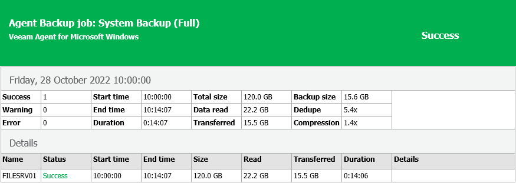

# Viewing Job Session Results in Email Reports

You can receive email notifications with Veeam Agent for Microsoft Windows job results. When the backup job session completes, Veeam Agent for Microsoft Windows will send a report containing data on the job session to the specified email address.

The report contains the following data:

* Cumulative job session statistics: session duration details, details of the session performance, amount of read, processed and transferred data, backup size, compression and deduplication ratios.
* Detailed statistics for the computer processed within the session: processing duration details, backup data size, amount of read and transferred data, list of warnings and errors (if any).
* If the backup job is set up to create database log backups, the report contains statistics for the database log backup job: a list of databases that were backed up at least once during the last session and information for the latest log processing intervals.
* If you use the backup cache, the report also contains statistics on the backup cache activity: a list of restore points created in the backup cache, their status and upload details. To learn more about the backup cache, see [Backup Cache](backup_cache.md).

To receive email reports, you must enable and configure email notifications in the Veeam Agent for Microsoft Windows Control Panel. To learn more, see [Enabling Email Notifications](settings_enable_email_notifications.md). Once email notifications are configured, Veeam Agent for Microsoft Windows will send email report for every backup job session that is started by schedule, manually or when you perform standalone full or incremental ad-hoc backup.

If the scheduled backup job fails, Veeam Agent for Microsoft Windows does not send a report after every job retry. Instead, Veeam Agent for Microsoft Windows sends one report on the first error within the job session and another report on the last job session result — success or error.

