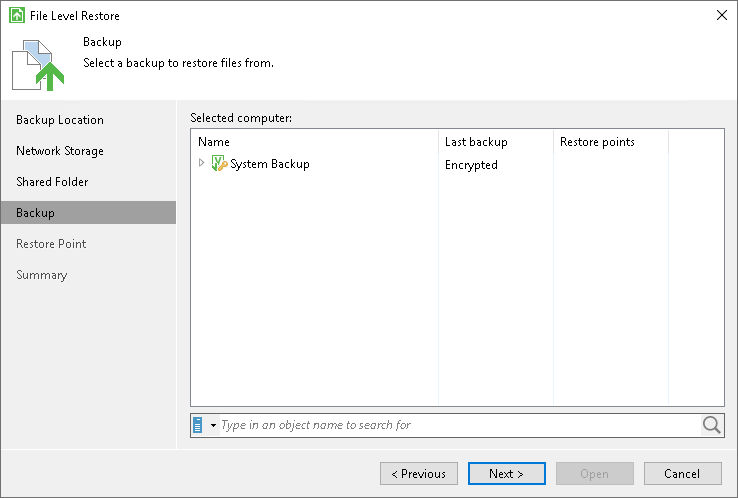
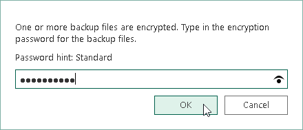

# Restoring Data from Encrypted Backups

You can perform restore from encrypted backups. In this case, backup files must be decrypted during the restore process.

|  |
| --- |
| IMPORTANT |
| You cannot restore data from a backup encrypted in Veeam Backup & Replication using KMS keys. |

To decrypt backup files and perform restore:

1. Launch the necessary data restore wizard:

* If you want to perform file-level or volume-level restore from an encrypted backup that was created on a Veeam Agent computer, right-click the Veeam Agent for Microsoft Windows icon in the system tray and select Restore > Individual files or Restore > Entire volumes. To learn more, see [Restoring Files and Folders](files_restore.md) and [Restoring Volumes](volume_restore.md).
* If you want to perform bare metal recovery from an encrypted backup, boot from the Veeam Recovery Media and launch the Veeam Recovery Media wizard. To learn more, see [Restoring from Veeam Recovery Media](image_boot.md).

1. At the Backup Location step of the wizard, specify where the encrypted backup file that you plan to use for restore resides. If the backup file resides in a remote location, at subsequent steps of the wizards, select the backup location type and specify settings to connect to the backup location.
2. At the Backup step of the wizard, select the encrypted backup.

1. In the Specify Password window, in the Password field, enter the password for the backup file.

In the Hint field of the Specify Password window, Veeam Agent for Microsoft Windows displays a hint for the password that was used to encrypt the backup file. Use the hint to recall the password.

|  |
| --- |
| NOTE |
| Veeam Agent does not require a password in the following cases:   * You perform restore from a backup file on the same Veeam Agent computer where the backup file was created using the same Veeam Agent for Microsoft Windows database. * You perform restore from a backup file that resides in the Veeam backup repository. Such backups are encrypted and decrypted on the Veeam Backup & Replication side, and Veeam Agent considers such backups unencrypted. To learn more, see [Data Encryption](data_encryption.md).   The restore process for backups stored in the Veeam backup repository is the same as for unencrypted backups. To learn more, see [Performing Restore](disaster_recovery.md).   * You have included encryption keys into the Veeam Recovery Media and perform bare metal recovery after booting from this Veeam Recovery Media. To learn more, see [Specify Recovery Media Options](image_create_options.md). |

Veeam Agent requires a password if at least one restore point in the backup chain is encrypted.

If you changed the password one or several times while the backup chain was created, you need to specify the latest password. In Veeam Agent for Microsoft Windows, you can use the latest password to restore data from all restore points in the backup chain, including those restore points that were encrypted with an old password. To learn more, see [Continuing Encrypted Backup Chain](encrypted_backup_chain.md).

If you enter correct password, Veeam Agent for Microsoft Windows will decrypt the backup metadata. You will be able to pass to the Restore Point step of the wizard and continue the restore operation in a regular manner.

Related Topics

[Restore from Encrypted Backups](encryption_restore.md)

