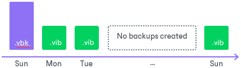

# General Short-term Retention Policy

Veeam Agent for Microsoft Windows retains the number of latest restore points for the number of days defined by the user. The maximum retention period is limited to 730 days. During every backup job session, Veeam Agent for Microsoft Windows checks if there is any obsolete restore point in the backup chain. If some restore point is obsolete, it is removed from the chain.

Veeam Agent for Microsoft Windows takes into account not calendar days but days on which backup files were successfully created. Veeam Agent ignores restore points created on the day when the retention policy is applied. In fact, Veeam Agent keeps restore points for the <N> + 1 days, where <N> is the number of days that you specified in the backup job settings.

For example, you have configured the backup job in the following way:

* The backup job runs daily.
* The retention policy is set to 5 days.

The backup job has successfully run 3 times and created 3 restore points in the backup chain. After that, you have turned off your computer for 10 days. When you turn on your computer, Veeam Agent for Microsoft Windows runs a backup job by schedule and creates a new restore point. The earliest restore point, however, is not removed from the backup chain. At the end of a new backup job session, the backup chain will have only 4 restore points created during 4 days when the backup job was successfully run.

Removing Backups by Retention

When the obsolete restore points are removed by retention, Veeam Agent transforms the backup chain so it always contains a full backup file on which subsequent incremental backup files are dependent. To do so, Veeam Agent uses the following rotation scheme:

1. During every backup job session Veeam Agent adds a backup file to the backup chain and checks if there is an obsolete restore point.

1. If an obsolete restore point exists, Veeam Agent transforms the backup chain. As part of this process, it performs the following operations:

1. Veeam Agent rebuilds the full backup file to include in it data of the incremental backup file that follows the full backup file. To do this, Veeam Agent injects into the full backup file data blocks from the earliest incremental backup file in the chain. This way, a full backup ‘moves’ forward in the backup chain.

1. Veeam Agent removes the earliest incremental backup file from the chain as redundant: its data has already been injected into the full backup file, and the full backup file includes data of this incremental backup file.

If the backup chain contains several obsolete restore points, the rebuild procedure is similar. Data from several restore points is injected to the rebuilt full backup file. This way, Veeam Agent makes sure that the backup chain is not broken, and you will be able to recover your data to any restore point.

