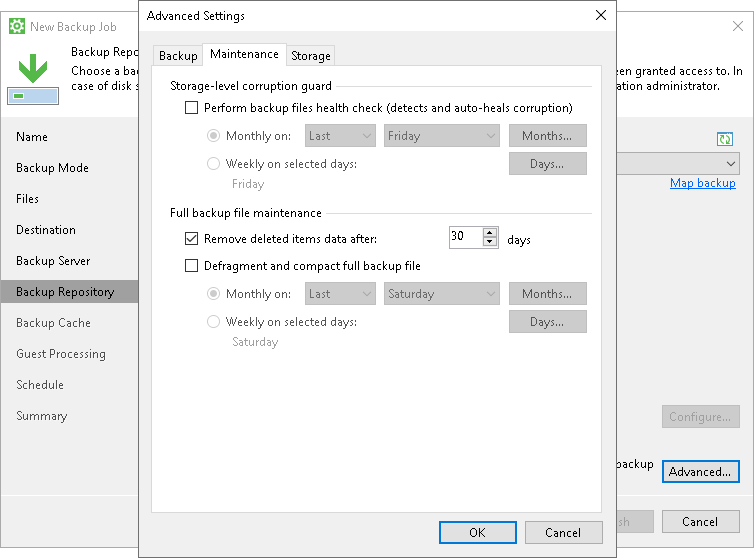

# Retention Policy for Outdated Backups

In addition to specifying general retention policy settings, you can define retention policy for outdated backups. An outdated backup is a backup for which no new restore points were created within the last <N> days. Retention policy for outdated backups helps to avoid keeping redundant data in the target location: once the outdated backup retention period is over, an outdated backup is automatically removed from the target location.

Veeam Agent for Microsoft Windows offers retention policy for outdated backups that are created in the following types of target locations:

* Veeam backup repository
* Veeam Cloud Connect repository

To specify retention policy for outdated backups, you must enable the Remove deleted items data after <N> days option in backup job settings and specify the number of days for which data of outdated backups must be retained in the backup repository. By default, Veeam Agent for Microsoft Windows retains outdated backups for 30 days.

Consider the following:

* You must use retention policy for outdated backups wisely. We strongly recommend that you set retention policy for outdated backups to 7 days or more to prevent unwanted data loss.

* In addition to retention policy for outdated backups, Veeam Agent for Microsoft Windows applies general retention policy rules to maintain the necessary number of restore points in the backup chain. To learn more, see [Backup Retention Policy](retention.md).

How Retention Policy for Outdated Backups Works

Although you specify retention policy settings for outdated backups in Veeam Agent for Microsoft Windows, actions required to track and delete outdated Veeam Agent backups are taken on the Veeam Backup & Replication side. Veeam Backup & Replication performs background retention for backups on the backup server. The background retention starts automatically every 24 hours at 00:30.

|  |
| --- |
| TIP |
| You can change the background retention schedule with registry values. For more information, [contact Veeam Customer Support](support_report.md). |

During the background retention session, Veeam Backup & Replication checks the configuration database for Veeam Agent backups stored in the backup repository. For each backup, it looks for information about the backup job that created it:

* If the job information exists, the Remove deleted items after <N> days option is enabled, and no new restore points, job sessions, or Microsoft SQL Server transaction log or Oracle archive log copies have been created in the last <N> days, Veeam Backup & Replication removes the backup from the configuration database and deletes backup files from the backup repository.
* If the job information is missing, Veeam Backup & Replication reviews the retention settings and either keeps or removes the backup, as described in the [Background Retention](https://helpcenter.veeam.com/docs/vbr/userguide/background_retention_job.html?ver=13) section in the Veeam Backup & Replication user guide.

The job information may be missing in the following cases:

* The backup job that created the backup was removed in Veeam Agent for Microsoft Windows.
* The Veeam Agent backup was imported in the Veeam Backup & Replication console.
* The Veeam Agent backup is a standalone full backup.

Related Topics

[Creating Backup Jobs](backup_job_create.md)

