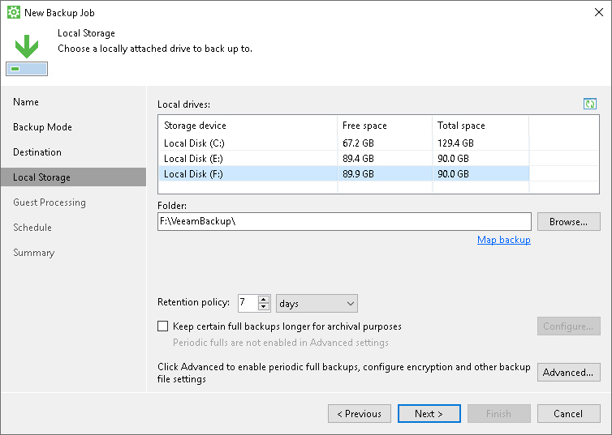
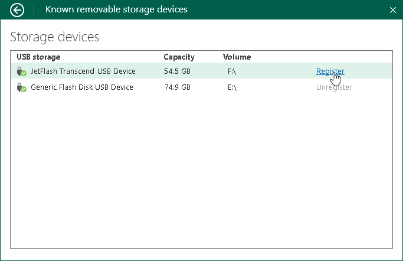
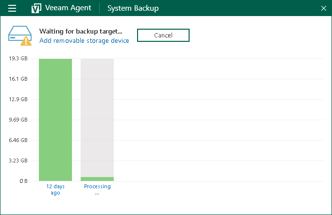

# Backup to Rotated Drives

You can use rotated drives as a target location for backups. This scenario can be helpful if you want to store backups on several external hard drives (for example, USB or FireWire) and plan to swap these drives between different locations regularly.

Backup on rotated drives is performed in the following way:

1. Veeam Agent for Microsoft Windows creates a backup chain on an external drive that you use as a backup target. The backup chain consists of the first full backup and a set of subsequent incremental backups.
2. When you swap drives and attach a new external drive, Veeam Agent creates a separate backup chain on the new drive.
3. After you swap drives again, Veeam Agent detects if there is a backup chain on the currently attached drive. If the backup chain exists, Veeam Agent continues the existing chain: it creates a new incremental backup file and adds it to the existing backup files.

To use rotated drives for backup, you must perform the following actions:

1. Attach one of external drives from the set to your computer.
2. Configure the backup job to store backups on the currently connected external drive. To do this:

1. At the Local Storage step of the wizard, select the connected drive.
2. From the Local drives list, select the necessary volume on the connected drive and specify a folder where backups must be stored.
3. Save the job settings.

1. When you need to swap files, disconnect the drive that was used previously and attach a new drive to your computer.
2. Register a newly connected drive as a known removable storage in Veeam Agent for Microsoft Windows. To do this:

1. Double-click the Veeam Agent icon in the system tray to open the control panel.
2. From the main menu, select Settings.
3. Click the Manage registered storage devices link.
4. Click Register next to the newly connected drive.

If you do not register the newly connected drive before the backup job starts, Veeam Agent will be unable to detect the backup target and launch the backup job. Veeam Agent will display a warning in the system tray and in the control panel. To register a new device, click the Add removable storage device link in the Status view of the control panel and register the newly connected drive as described above. To learn more, see [Managing Rotated Drives](managing_devices.md).

1. After you register the newly connected drive, you can start a new backup session manually or wait Veeam Agent to start a new session.

|  |
| --- |
|  NOTE |
| Keep in mind that you cannot target a backup job at a certain set of rotated drives. If the backup job to rotated drive starts, and the drive that was used previously is not connected, Veeam Agent creates a backup file on any registered drive that is currently attached to the Veeam Agent computer. |

