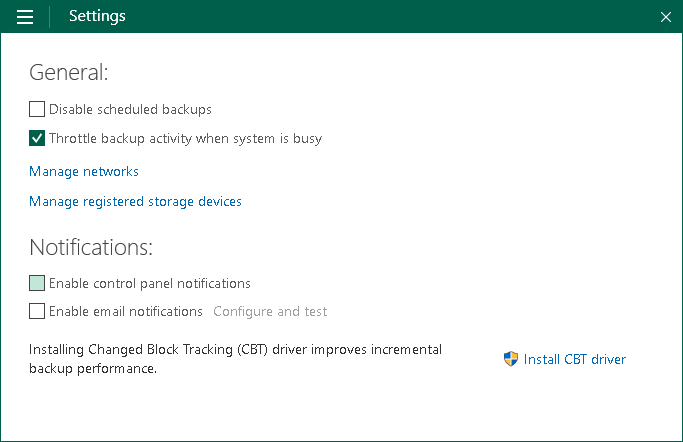

# Disabling Control Panel Notifications

Veeam Agent for Microsoft Windows displays warning and information messages on the notification bar in the Control Panel. If necessary, you can disable Veeam Agent notifications.

To disable notifications:

1. Double-click the Veeam Agent for Microsoft Windows icon in the system tray, or right-click the Veeam Agent for Microsoft Windows icon in the system tray and select Control Panel.
2. From the main menu, select Settings.
3. In the Notifications section, clear the Enable Control Panel notifications check box.

