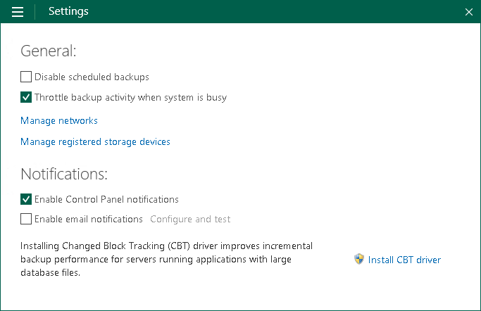

# Enabling Email Notifications

You can enable Veeam Agent for Microsoft Windows email notifications to receive reports containing data on the latest backup job session statistics and result.

To enable email notifications:

1. Double-click the Veeam Agent for Microsoft Windows icon in the system tray, or right-click the Veeam Agent for Microsoft Windows icon in the system tray and select Control Panel.
2. From the main menu, select Settings.
3. In the Notifications section, select the Enable email notifications check box and click the Configure and test link.
4. In the Configure and test email notifications window, select one of the Mail Server options and specify the required settings:

* [Custom SMTP server settings](settings_enable_email_notifications_smtp.md).
* [Gmail server settings](settings_enable_email_notifications_google.md).
* [Microsoft 365 server settings](settings_enable_email_notifications_microsoft.md).

Disabling Email Notifications

To disable email notifications, clear the Enable email notifications check box in the Settings tab of the Control Panel. Current email notifications configuration will remain saved in the Veeam Agent database.

