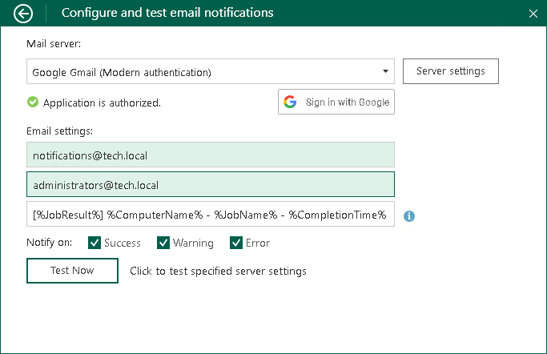

# Gmail Server Settings

To connect to the Gmail server, specify the following settings in the Configure and test email notifications window:

1. In the Mail server section, specify the following:

1. Select the Google Gmail (Modern authentication) option from the drop-down list.
2. Click the Sign in with Google button, enter your Google account credentials and complete Google authorization process.

|  |
| --- |
| IMPORTANT |
| When you are prompted to allow Veeam Agent sending emails on behalf of your Google account, grant the permission and click Continue. |

1. In the Email settings section, specify the following:

1. If necessary, change the email address in the From email address field to its alias.
2. If necessary, change the recipient email address in the To email address field. You can specify several recipient email addresses separated with a comma or semicolon.
3. In the Email subject filed, specify a subject for the message. You can use the following variables in the subject:

1. %JobResult%
2. %ComputerName%
3. %JobName%
4. %CompletionTime%

1. In the Notify on section, select the Success, Warning or Error check boxes to receive email notification if a job is run successfully, not successfully or with a warning.

1. [Optional] Click Test now to validate the Gmail server settings and send a test email.

To specify custom authentication options, do the following:

1. Click the Server settings button.
2. Select the Use custom settings check box.
3. Specify the application client ID and the client secret.

To learn how to register your custom application, see [Registering Application in Google Cloud Console](settings_register_google_app.md).

