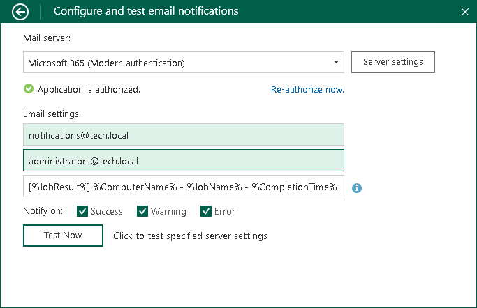

# Microsoft 365 Server Settings

To connect to the Microsoft 365 server, specify the following settings in the Configure and test email notifications window:

1. In the Mail server section, specify the following:

1. Select the Microsoft 365 (Modern authentication) option from the drop-down list.
2. Click the Authorize now button and enter your Microsoft 365 account credentials or choose an account from the suggested list.

|  |
| --- |
| IMPORTANT |
| When you are prompted to grant Veeam Agent access to your Microsoft 365 profile, accept the permissions listed in the opened window. |

1. In the Email settings section, specify the following:

1. If necessary, change the email address in the From email address field to its alias.
2. If necessary, change the recipient email address in the To email address field. You can specify several recipient email addresses separated with a comma or semicolon.
3. In the Email subject filed, specify a subject for the message. You can use the following variables in the subject:

1. %JobResult%
2. %ComputerName%
3. %JobName%
4. %CompletionTime%

1. In the Notify on section, select the Success, Warning or Error check boxes to receive email notification if a job is run successfully, not successfully or with a warning.

1. [Optional] Click Test now to validate the Microsoft 365 server settings and send a test email.

To specify custom authentication options, do the following:

1. Click the Server settings button.
2. Select the Use custom settings check box.
3. Specify the application client ID and the tenant ID.

To learn how to register your custom application, see [Registering Application in Microsoft Azure Portal](settings_register_azure_app.md).

